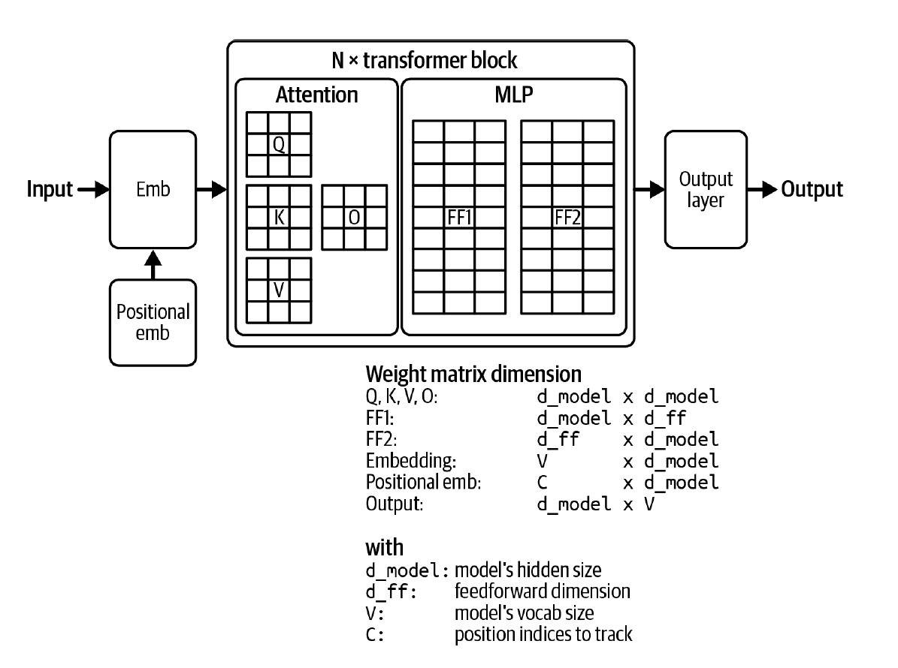
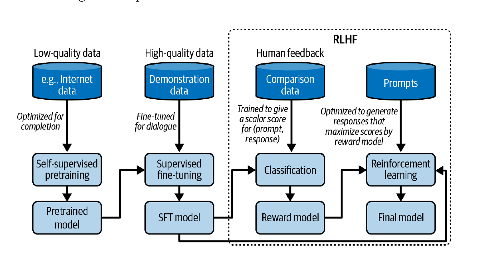

- This is completely based on [AI Engineering By Chip Huyen](https://www.oreilly.com/library/view/ai-engineering/9781098166298/)

<!-- - For the code part, you can checkout this [link](https://github.com/riteshrm/Quantization-Fundamentals-deeplearning.ai-) -->

# Chapter 1 Introduction to Building AI Applications with Foundation Models
## Language Models (LMs)

### Masked Language Models (MLM)

- Predict missing tokens in a sentence  
  *Example:* `My favorite __ is blue`
- Use **bidirectional context** (both previous and next tokens)
- Common use cases:
  - Sentiment analysis
  - Text classification
  - Code debugging (requires full contextual understanding)
- **Example:** BERT (Bidirectional Encoder Representations from Transformers)

### Generative Language Models

- A language model can generate **infinite outputs** using a **finite vocabulary**
- Models capable of producing open-ended outputs are called **generative models**
- This forms the basis of **Generative AI**

---

## Learning Paradigms

### Self-Supervised Learning

- Labels are automatically derived from the input data itself

### Unsupervised Learning

- No explicit labels are required

---

## When to Outsource Model Building

### Build In-House When

- The model is critical to business differentiation
- There is a risk of exposing intellectual property to competitors

### Outsource When

- It improves productivity and profitability
- It provides better performance and multiple vendor options

---

## Role of AI in Products

### Critical vs Complementary

- **Complementary:**  
  The application can function without AI (e.g., Gmail)
- **Critical:**  
  The application cannot function without AI (e.g., face recognition)  
  Requires high robustness and reliability

### Reactive vs Proactive

- **Reactive:**  
  Responds to user inputs (e.g., chat-based responses)
- **Proactive:**  
  Takes initiative (e.g., traffic alerts in navigation apps)

### Static vs Dynamic

- **Static:**  
  Features are updated only during application upgrades
- **Dynamic:**  
  Features evolve continuously based on user feedback

---

## Automation in Products (Microsoft Framework)

- **Crawl:**  
  Human involvement is required
- **Walk:**  
  AI assists and interacts with internal employees
- **Run:**  
  AI directly interacts with end users

::: callout-note
## Key Insight
Achieving **0–60% performance is relatively easy**, but moving from **60–100% is extremely challenging**.
:::

---

## Three Layers of the AI Stack

### Application Development Layer

- AI Interface
- Prompt Engineering
- Context Construction
- Evaluation

### Model Development Layer

- Inference Optimization
- Dataset Engineering
- Modeling and Training
- Evaluation

### Infrastructure Layer

- Compute Management
- Data Management
- Model Serving
- Monitoring

---

## AI Engineering vs ML Engineering

### AI Engineering

- Uses pretrained models
- Works with large-scale models
- Requires higher compute resources
- Workflow:  
  **Product → Data → Model**

### ML Engineering

- Trains models from scratch
- Requires fewer resources
- Workflow:  
  **Data → Model → Product**

---

## Adapting Pretrained Models

- **Prompt Engineering**
- **Fine-tuning**
  - Training a pretrained model on a new task not seen during pretraining

---

## Training Stages

### Pretraining

- Resource-intensive (large data and compute)
- Model weights initialized randomly
- Trained for general text completion

### Fine-tuning

- Requires significantly less data and compute
- Adapts the model to task-specific objectives

### Post-training

- Often used interchangeably with fine-tuning
- **Model developers:**  
  Perform post-training before releasing the model (e.g., instruction-following)
- **Application developers:**  
  Fine-tune released models for specific downstream tasks

# Chapter 2 Understanding Foundation Models

## Model Performance Fundamentals

- Model performance depends on both:
  - **Training process**
  - **Sampling (decoding) strategy**
- An AI model is only as good as the **data it is trained on**
- The *“use what we have, not what we want”* dataset mindset often leads to:
  - Strong performance on training data
  - Weak performance on real-world tasks
- **Small, high-quality datasets** can outperform **large, low-quality datasets**

---

## RNNs vs Transformers

- **Recurrent Neural Networks (RNNs)**
  - Generate text using a compressed **summary of the book**
  - Struggle with long-range dependencies

- **Transformers**
  - Attend directly to many tokens at once
  - Comparable to generating text using **entire pages of a book**
  - Enable long-context modeling via attention

---

## Transformer Architecture

### Transformer Block

Each transformer block consists of:
- Attention module
- MLP (feedforward network)

### Transformer-Based Language Model

A typical transformer-based LM includes:

- **Embedding Module (pre-transformer)**
  - Converts tokens into embedding vectors
- **Transformer Blocks**
- **Model Head (post-transformer)**
  - Converts hidden states into token probabilities

<figure style="text-align: center;">
  
  <figcaption>Figure 2.1: Visualization of the weight composition of a transformer model.</figcaption>
</figure>

---

## Alternatives to Transformers

- **RWKV**
  - RNN-based architecture
  - No fixed context-length limitation
  - Performance on extremely long contexts is not guaranteed

- **State Space Models (SSMs)**
  - Designed for long-range memory
  - Promising alternative to attention
  - Examples:
    - Mamba
    - Jamba (Hybrid of Transformer and Mamba)

---

## Training Tokens and Scaling Laws

- $\text{Total Training Tokens} = \text{Epochs} \times \text{Tokens per epoch}$

- **Chinchilla Scaling Law**
  - Optimal training tokens ≈ **20× model parameters**
- Research from Microsoft and OpenAI suggests:
  - Hyperparameters can be transferred from a **40M** model to a **6.7B** model

---

## Pre-training and Post-training

- **Pre-training**
  - Equivalent to *reading to acquire knowledge*
  - Resource-intensive
  - Produces general-purpose representations

- **Post-training**
  - Equivalent to *learning how to use knowledge*
  - Includes instruction tuning, alignment, and RLHF

<figure style="text-align: center;">
  
  <figcaption>Figure 2.2: Training workflow of a large language model.</figcaption>
</figure>

- Training only on high-quality data without pre-training is possible,
  but **pre-training followed by post-training yields superior results**

---

## Reinforcement Learning from Human Feedback (RLHF)

RLHF is a two-stage process for aligning language models with human preferences:

1. **Train a reward model** that scores the foundation model's outputs
2. **Optimize the foundation model** to generate responses that maximize the reward model's score

### Preference Data Structure

Instead of using scalar scores (which vary across individuals), RLHF uses comparative preferences:

- Each training example consists of: $(prompt, winning\_response, losing\_response)$
- This pairwise comparison approach captures relative quality more reliably than absolute ratings

### Reward Model Training

#### Objective

Maximize the score difference between winning and losing responses for each prompt.

#### Mathematical Formulation

**Notation:**

- $r$: reward model
- $x$: prompt
- $y_w$: winning response
- $y_l$: losing response
- $s_w = r(x, y_w)$: reward score for winning response
- $s_l = r(x, y_l)$: reward score for losing response
- $\sigma$: sigmoid function

**Loss Function:**

$$
\mathcal{L} = -\log(\sigma(s_w - s_l))
$$

where $\sigma(z) = \frac{1}{1 + e^{-z}}$

**Goal:** Minimize this loss function across all preference pairs

#### Model Architecture Choices

The reward model can be:

::: {.callout-note}
### Reward Model Options

- **Trained from scratch** on preference data
- **Fine-tuned from a foundation model** (often preferred, as the reward model should ideally match the capability level of the model being optimized)
- **A smaller model** (can also work effectively in practice, offering computational efficiency)
:::

### Key Insights

::: {.callout-tip}
### Important Takeaways

- Pairwise preferences are more consistent and reliable than absolute ratings
- The sigmoid in the loss function ensures the model learns relative differences in quality
- The reward model's capacity should generally align with the foundation model it's evaluating
:::

---
## Sampling Strategies and Model Hallucination
### Temperature-Based Sampling

#### Core Formula

$$
P(token) = \text{softmax}\left(\frac{\text{logits}}{\text{temperature}}\right)
$$

### Temperature Effects

- **Higher temperature** reduces the probability of common tokens, thereby increasing the probability of rare tokens
- This enables more **creative and diverse responses**
- **Standard value**: Temperature of **0.7** balances creativity with coherent generation

::: {.callout-tip}
## Monitoring Model Learning

To identify if a model is learning, examine the probability distributions. If probabilities remain random across training, the model is not learning effectively.
:::

### Numerical Stability

To avoid underflow issues (since probabilities can be extremely small), we use **log probabilities** in practice.

## Advanced Sampling Strategies

### Top-k Sampling

- Select the **k largest logits**
- Apply softmax only to these k tokens to compute probabilities
- **Benefit**: Reduces computational cost and filters out unlikely tokens

### Top-p (Nucleus) Sampling

- Find the **smallest set of tokens** whose cumulative probabilities sum to $p$
- **Process**: Sort tokens by probability (descending order) and keep adding until cumulative probability reaches $p$
- More adaptive than top-k as the number of considered tokens varies

### Min-p Sampling

- Set a **minimum probability threshold** for tokens to be considered
- Any token with probability below this threshold is excluded from sampling

### Best-of-N Sampling

- Generate **multiple responses** for the same prompt
- Select the response with the **maximum average probability**
- Improves output quality at the cost of increased compute

## Handling Structured Outputs

### 1. Prompting Techniques

- **Better prompt engineering** with clear instructions
- **Two-query approach**: 
  - First query generates the response
  - Second query validates the response format

### 2. Post-Processing

- Identify **repeated common mistakes** in model outputs
- Write scripts to correct these systematic errors
- Works well when the model produces mostly correct formats with predictable issues

### 3. Constrained Sampling

- Sample only from a **selected set of valid tokens**
- **Example**: In JSON generation, prevent invalid syntax like `{{` without an intervening key
- Enforces grammatical/syntactic correctness at the token level

### 4. Test-Time Compute

- Generate multiple candidate responses
- Use a selection mechanism to output the best one
- Trade compute for quality

### 5. Fine-Tuning

::: {.callout-important}
## Best Solution

Fine-tuning is the most effective approach for structured outputs:

- **Full model fine-tuning** (better if resources available)
- **Partial fine-tuning** (LoRA, adapters, etc.)
- Directly teaches the model the desired output format
:::

## Model Hallucination

### Definition

**Hallucination** occurs when a model generates responses that are **not grounded in factual information**.

### Consistency Issues

Due to the **probabilistic nature** of language models:

- Same prompt can produce **multiple different outputs**
- This inconsistency can be problematic for production systems

#### Mitigation Strategies

1. **Caching**: Store responses for repeated queries to ensure consistency
2. **Sampling adjustments**: Modify temperature, top-k, or top-p parameters
3. **Deterministic seeds**: Use fixed random seeds

::: {.callout-warning}
## No Perfect Solution

Even with these techniques, **100% consistency is not guaranteed**. Hardware differences in floating-point computation can lead to variations across different systems.
:::

## Why Models Hallucinate

### Hypothesis 1: Self-Supervision is the Culprit

**Problem**: Models cannot differentiate between:

- **Given data** (the prompt)
- **Generated data** (their own outputs)

#### Example Scenario

1. **Prompt**: "Who is Chip Huyen?"
2. **Model generates**: "Chip Huyen is an architect"
3. **Next token generation**: The model treats "Chip Huyen is an architect" as a fact, just like the original prompt
4. **Consequence**: If the initial generation is incorrect, the model will continue to justify and build upon the incorrect information

#### Mitigation Techniques

::: {.callout-note}
## Approach 1: Reinforcement Learning

From RL perspective, train the model to differentiate between:

- **Observations about the world** (given text/prompt)
- **Model's actions** (generated text)

This helps the model maintain awareness of what is given vs. what it produces.
:::

::: {.callout-note}
## Approach 2: Supervised Fine-Tuning with Counterfactuals

Include both **factual** and **counterfactual** examples in training data, explicitly teaching the model to recognize and avoid false information.
:::

### Hypothesis 2: Supervision is the Culprit

**Problem**: Conflict between the model's internal knowledge and labeler knowledge during SFT (Supervised Fine-Tuning).

#### The Issue

- During SFT, models are trained on responses written by **human labelers**
- Labelers use their own knowledge to write responses
- The **model may not have access** to the same knowledge base
- Result: The model learns to produce responses it cannot properly ground, leading to hallucination

#### Better Approach

::: {.callout-tip}
## Solution: Include Reasoning Chains

When creating training data:

1. **Document the information sources** used to arrive at the response
2. **Include reasoning steps** that show how the conclusion was reached
3. This allows the model to understand **not just what to say**, but **why** and **based on what information**
:::

# Chapter 3 Evaluation Methodology

## Challenges of Evaluating Foundation Models
  + As AI becomes more intelligent, it is hard to evaluate them. Most people can evalaute the 1st grade maths but not phd level
  + There are so many possibilities for a single query since foundation models are open-ended not like ML classification models, where it is wrong if predicts y instead of x
  + For most of the models, their architecture, training data, training processes are not exposed, so we dont know whether we are evaulating it on wrng task or not

+ Evaluation is not about only assessing the model's performance on specific task, it also helps in finding out the potenital and limitations of foundation model

## Language Modeling Metrics
+ Entropy:- is how much information a token carries, Higher the entropy more info and more bits are needed to represent
  - Consider two languages one with 2 tokens and other with 4 tokens, both have 1 and 2 entropy respetively. thus making hardr for prediction whn entropy is 4
  - Entropy is basically how hard it is to predict next token

+ Cross Entropy:- how much difficult it is to predict next token by a language model on a dataset
+ A language model is trained to minimize its cross entropy with respect to training data
  - H(P, Q) = H(P) + Dkl(P||Q)
  - where H(P, Q) is entropy of P(true distribtuion) with respect to Q(distribution learned by model)
  - while traing a language model, we want to minimize this

+ Bits-per-character and Bits-per-byte
  - BPC:- bits required to represent a token, eg. if a tokenizer takes 6 bits to represnt a token and token have 2 chars then BPC is 3
  - Since there can be multiple encoding schemes[ASCII(7 bits), UTF-8(8-32bits)], bits-per-character will differ
  - BPB:- bits a language model need to represent 1 byte of training data
    + lets say BPC is 3 of the trained model and 7 bits are required to represent a single character of training datta then we can say that
      - 7 bit of data is beng represnted using 3 bit
      - 1 bit of data is being represented using 3/7 bits
      - so for 1 byte i.e. 8bit it is 24/7 
      - it simply means that 3.43 bits are needed by model to represnt 1 byte of training data

+ Perplexity
  - It is the exponential of entropy and cross entropy
  - PPL(P) = 2^H(P)
  - PPL(P, Q) = 2^H(P, Q)
  - If cross entropy measures how difficult it is to pedict next token then ppl defines how uncertain it for predicting the  next token, i.e. higher the ppl more will be options
  - If base 2 then bits and if base is e then nat

+ Perplexity Interpretation and Use Cases
  - More structured data gives lower PPL. HTML will have lower PPL compared to everyday text since after `<head>` there will always be `</head>`.
  - The bigger the vocabulary, the higher the PPL since there will be lot of the options for predicting
  - The longer the cntext length, the less will be PPL i.e if a model have more context then it will have less uncertainty in predicting next token
  - PPL can be used to identify if the model was trained on given dataset or not, since if the model has seen the data in training time then it will have lower PPL otherwise higher PPL

+ Post-training techniques like SFT or RLHF may lead to increase in PPL, since they gets modified for completion task from next token prediction 
+ Formula to calculate PPL given n tokens

## Exact Evaluation
+ Functional Correcteness
  - Whether the model is generating the intended texts or not e.g. if asked to create a website whether the created website is as intended or not
  - Functional correctness of codes can be automated easily by passing the genertaed code to a particular interpreter to check if the ouput from the generated code is same  as the expected one or not
  - pass`@k` x%:- fraction of passed sample cases at generation number k

+ Similarity measurements against reference data
  - Generated responses that are more similar to the reference responses are considered to be better
  - There are 4 ways to measure similarity between two open-ended texts:-
    + Ask an evaluator, whether the two texts are same or not
    + Exact match: Does generated response matches exactly with one of the reference responses
    + Lexical similarity: How similar generated response looks to the refernce response
    + Semantic Similarity: How close they are semantically in meaning

  - Exact Match:-
    + When we hvae to generate short answers or deterministic ouputs.
    + It gives output either 1 or 0
    + 2+3=?. If genertaed response is 5 or "The answer is 5" is acceptable
    + If the input was "Birthday of XYZ" and if it gives correct year but not date then it is considered wrong
    + but in case of translation there might be multiple sequence possible for a given text 
  
  - Lexical Similarity:-
    + One way is to count the number of tokens which are in common [can be increased to n-gram tokens instead of comparing 1 token (what percentage of reference responses is also in the generated responses)]
    + Use some fuzzy logic i.e. edit distance [insert, delete substitute] to check how much edits are need to get the same text
    + Common metrices are BLEU, ROUGE, METEOR++, TER, CIDEr
    + Some cons are that:-
      - we have to curate all the possible reference data samples. 
      - It is also possible that the model generates a good quality text and gets lower score because the generated text was not found in refernce data
      - It is also possible that refernce data is wrong, so reference based evaluations are not good considering refernce free ones
      - Also it is not possible to blindly trust this metric. eg. on some code benchmark BLUE score was same for incorrect as well as correct ouputs

  - Semantic Similarity:-
    + It calculates the similarity in semantics by converting given texts in to embedding
    + Cosine similarity is used to find out the similarity
    + 1 if they are almost similar, -1 if they are completely opposite
    + This is under exact  match, because embedding generation algo might differ but calculation of semnatic similary will be same
    + Metric for semantic textual similarity
      - BERTScore:- Embeddings are generated by BERT
      - MoverScore:- Embeddings are generated by mixture of algorithms
    + Cons is that what if embeding generation module is not perfect then even if two texts are semantical same, it will say otherwise and there is an overhead of compuatation of embedding

+ Benchmark that measures the embedding quality on various tasks is MTEB[Massive Text Embedding Benchmark] 

## AI as a Judge
+ AI judges are cheap in comparison of humans

+ There are three ways you can use AI to evaluate:-
  - Using the AI itslef which generated the response
  - Using AI to compare against a given refernce data
  - Using another response

+ Use discrete scoring, less the options for scoring better will be the evaluation by AI
+ Evaluation can also be made better by giving the possible examples for each category or score

+ Limitations:
  - Inconsistency:- Since they are probabilistic, they will give different output for the same prompt
  - Criteria-Ambiguity:- Some AI evaluators give yes no, some give 1-5 or 1-2. What is the evaluator changed or the prompt used was changed
  - Increased Cost & Latency:- Using AI evaluations can add upto to inference cost as well as add latency to the whole pipeline
  - Biases of AI as a judge:- AI evalators tend to prefer their reponses over the responses generated other models even it is not correct
    + first postion bias as they tend to prefer first option as opposite of humans, where they prefer last option
    + verbosity bias is favouring lengthier outputs even if it is wrong

## What models can act as a Judge?
+ Strong Model as Judge
  - Evaluate a subset of responses generated by a stronger model
+ Same model as Judge
  - It is like cheating, but it would help in sanity check that if the model itself thnks the output is not correct then the model itself is not good
+ Weaker model as judge
  - Since judging is easier than generating a response

+ Specialised AI Judges
  - Reward model:- Given a pair of prompt and response, it gives a score of how good response is
  - Refrence based Judge:- Evaluate similarity score or quality against given refernce responses
  - Preference Model:- Given multiple response for a prompt, they provide ranking

## Ranking Models with Comparative Evaluation
+ We evaluate models, not because we want to check their scores but to find out which one is better for our use case
+ Pointwise Evaluation is evaluating each model independenlty and then comapring their scores
+ Comaparative Evaluation is evaluating models against each other and then ranking them from comparative results. For e.g. asking the participants to dance simultaneusly and then judge them
+ Comparative evaluation is better since we have to compare responses instead of giving score to each response
+ One think to note is that responses can not be calculated solely based on preference for example there are some questions which needs to be judged by correctness 
+ Also giving two responses for a math problem and then asking the user to give the prefernce score. If user know about that problem then why would he had asked about it
+ Basically for a preference based voting only works when voters are knowledgeable in the subject
+ There is a difference between A/B testing and comparative evaluation
  - in A/B testing we use same model to get the outputs
  - in comparative evaluation, we use different models for same input to get different outputs

## Challeneges of Comparative Evaluation
+ Scalibility Bottleneck:- Comparartive Evaluations are data intensive. Whenever a new model comes in we have to evaluate it against existing ones which will change the ranking. There is also no clearity on transitivity if A better than B and B is better than C then it does not imply that A is better than C. To mititgate these issues, we can design a matching algorithm which will help try to distinguish when there is more confusion between two models rather than evaluation two models which are already far from each other in performance
+ Lack of standardization and quality control:- There is not a standard way to evaluate. Someone on internet might prefer facts instead of gramaically, some might prefer toxic contents which is good and bad also. There is also lack of prompts to evaluate for example there might be 
305
