- This is mostly based on [Positional Encoding in Transformer](https://www.youtube.com/watch?v=dWkm4nFikgM)


# Positional Encoding (PE)
- RNNs process tokens sequentially so they have information about the position of tokens of a given sequence.
- Transformers process all the tokens simultaneously where each token attends to every other token.
- *For Example:*:-
  + my daughter called her brother [where each word is a token]
  + in above sentence **my** will attend to all other tokens and similarly others will also attend other tokens.
  + now consider other permutation of above sequence her daughter called my brother
  + even in above example, permutation is different but transformers will find out the same context for each word as above one
  + a simple explanation would be consider **my** and **her**
    - the attention between these will be same for both of the sequences, but both of them corresponds to different meaning.
    - so to have different attentions for different sequences we need to inject some information about the positions of words also.

---

# Attempted Solution

- Use the index of tokens directly as position information for a given sequence. However, when we add token embedding with this position indices, positional information will overpower the content signal and also, the rightmost tokens will dominate.

- Now, to solve this, we can normalize the positional information i.e. normalize with the length of sequence. But now we have another problem, all of the sequences will never be of same length, so each position information will keep varying. For example lets consider two sequences 
  1. I am going  PE:=[0/3 1/3 2/3]
  2. All of us are going PE:=[0/5 1/5 2/5]
 - As we can see in above example, in sequence we are normalizing by 3 and in 2nd one by 5, which is not good for a model to learn like one time we are saying that 2nd positions value is 0.33 and in the next sequence we are saying no no, its 0.2

---


# Sinusoidal Positional Encoding

- The authors of the Transformer paper introduced sinusoidal functions to address this issue.

- The positional encoding is defined as:

  - For even indices:

  $$
  PE(pos, 2i) = \sin\left(\frac{pos}{10000^{\frac{2i}{d_{model}}}}\right)
  $$

  - For odd indices:

$$
PE(pos, 2i + 1) = \cos\left(\frac{pos}{10000^{\frac{2i}{d_{model}}}}\right)
$$

- *where*
  - pos is the position of token
  - $d_{model}$ is dimensionality of position embedding
  - i is index of embedding dimension where i runs from 0 to $d_{model}$/2 -1 [each value of i corresponds to one frequency of sinusoid]

## Below is python code for getting 1D Sinusoidal Position Embedding

```{python}
import torch
from typing import Union

def get_1d_sin_cos_pe(d_model:int, pos:Union[int, list]):
    if type(pos)==int:
        pos = [pos]
    n_tokens = len(pos)
    pos = torch.tensor(pos).reshape(n_tokens, -1)
    div_term = torch.tensor([10000**(2*i/d_model) for i in range(d_model//2)])
    sinPE = torch.sin(pos/div_term)
    cosPE = torch.cos(pos/div_term)
    combinedPE = torch.zeros(n_tokens, d_model)
    combinedPE[:, 0::2] = sinPE
    combinedPE[:, 1::2] = cosPE

    return combinedPE

# For single position
d_model = 512
pos = 2
pe2 = get_1d_sin_cos_pe(d_model, pos)

d_model = 512
pos = 3
pe3 = get_1d_sin_cos_pe(d_model, pos)

combinedPE = torch.cat([pe2, pe3], dim=0)

# For multiple positions 
d_model = 512
pos = [2, 3]
pe = get_1d_sin_cos_pe(d_model, pos)

print(torch.equal(combinedPE, pe))

```

## Lets see only sine for intuition

<figure style="text-align: center;">
  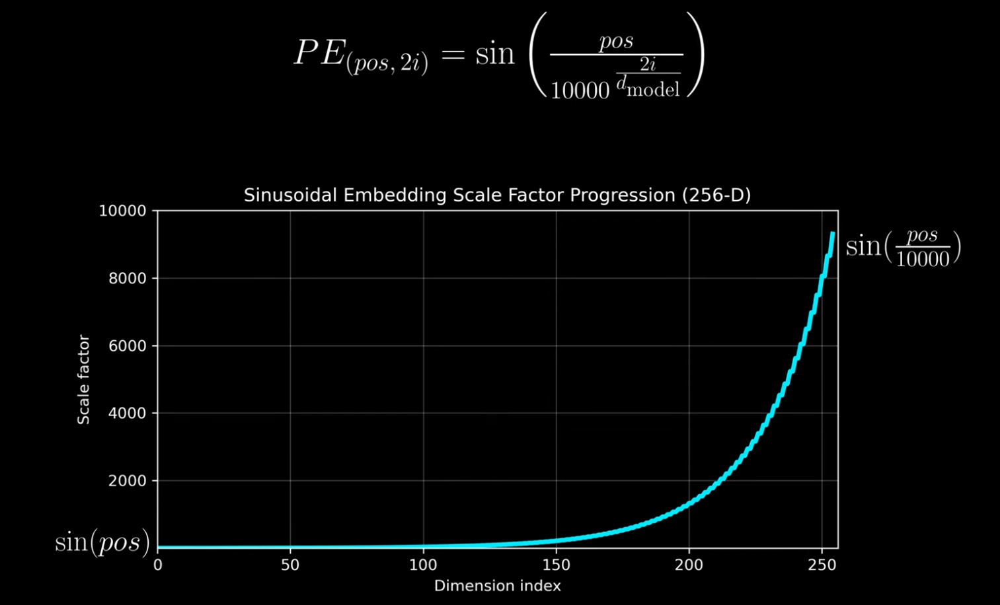
  <figcaption>As dimension index increases, scaling factor also increases</figcaption>
</figure>

- As the scaling factor increases, the period of sin wave increases frequency decreases i.e. the repetition of values decreases.
- We can also say that as scale factor increases, the oscillation becomes slower.

- Dimension 0 i.e. lower dimension can incorporate fine grained local positional information.
- Value at k is far different than value at k + 5 as we can see from below figure.

<figure style="text-align: center;">
  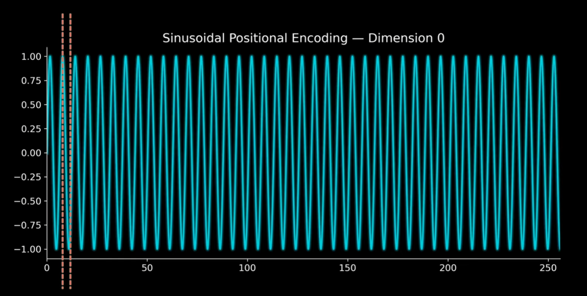
  <figcaption></figcaption>
</figure>

---

- Dimension 255 i.e. higher dimensions incorporates global positional information
- Value at k and k+5 is nearly similar but at k and k+200 is quite different as we can see from the below figure.

<figure style="text-align: center;">
  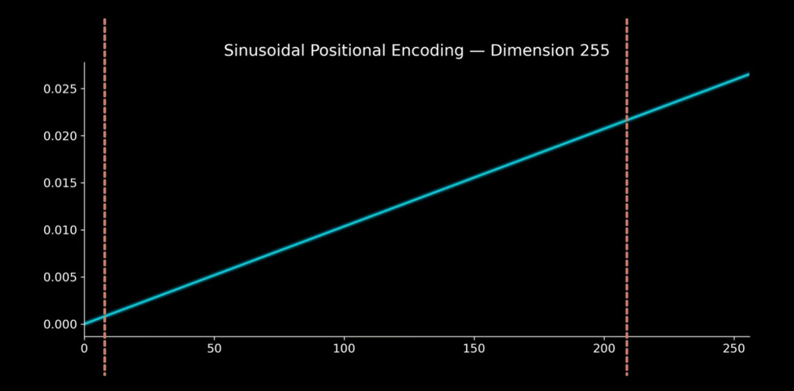
  <figcaption></figcaption>
</figure>

---

+ Basically given a particular position pos, it gets mapped to various sine waves which incorporates local as well as global information as we can see from below figure.

<figure style="text-align: center;">
  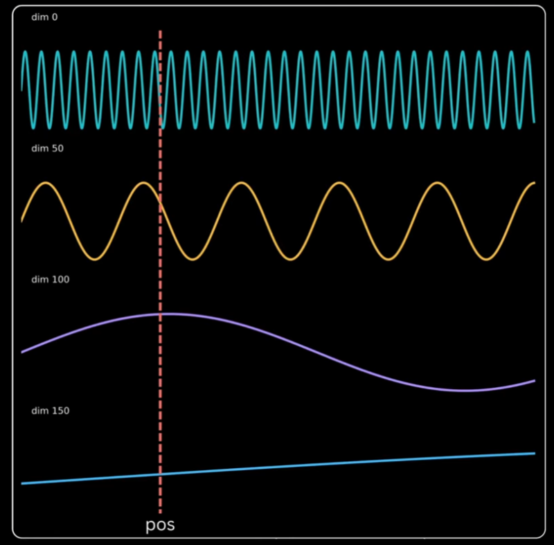
  <figcaption></figcaption>
</figure>

## Key Observations

- Earlier indices (smaller \( i \)):
  - Capture **short-range information**
  - High-frequency variations

- Later indices (larger \( i \)):
  - Capture **long-range information**
  - Low-frequency variations

- This creates a mix of:
  - Short-range patterns (rapid oscillations)
  - Long-range patterns (slow oscillations)

## Connection to Binary Encoding

- As frequency decreases, **bit significance increases**
- Similar to binary representation:
  - Rightmost bits → change frequently (low significance)
  - Leftmost bits → change slowly (high significance)

- Moving from right → left:
  - Repetition decreases
  - Importance increases

- And this is what we want from a positional encoding, where it can help in differentiate local as well as global tokens.
- But since Binary Encodings are discrete and does not change smoothly for example BE of 3 is 11 and BE of 4 is 100, which is not continuous whereas sinusoidal waves are continuous and change smoothly from pos to pos + 1.

---

### Locality Insight

For small values of i:

- PE(pos) and PE(pos + 1) are **very different**
- PE(pos) and PE(pos + k) are **more similar for larger k**

Implication:

- Helps distinguish **nearby tokens**

---

### Global Insight

For large values of i:

- PE(pos) and PE(pos + 1) are  **more similar**
- PE(pos) and PE(pos + k) are **very different for larger k**

Implication:

- Helps distinguish **Far-apart tokens**

---

# Why 10000?
## What happens if we chose 100
- From below graph we can see that even higher dimension starts repeating themselves i.e. their frequency increases and thus we cant distinguish between far-apart tokens 

<figure style="text-align: center;">
  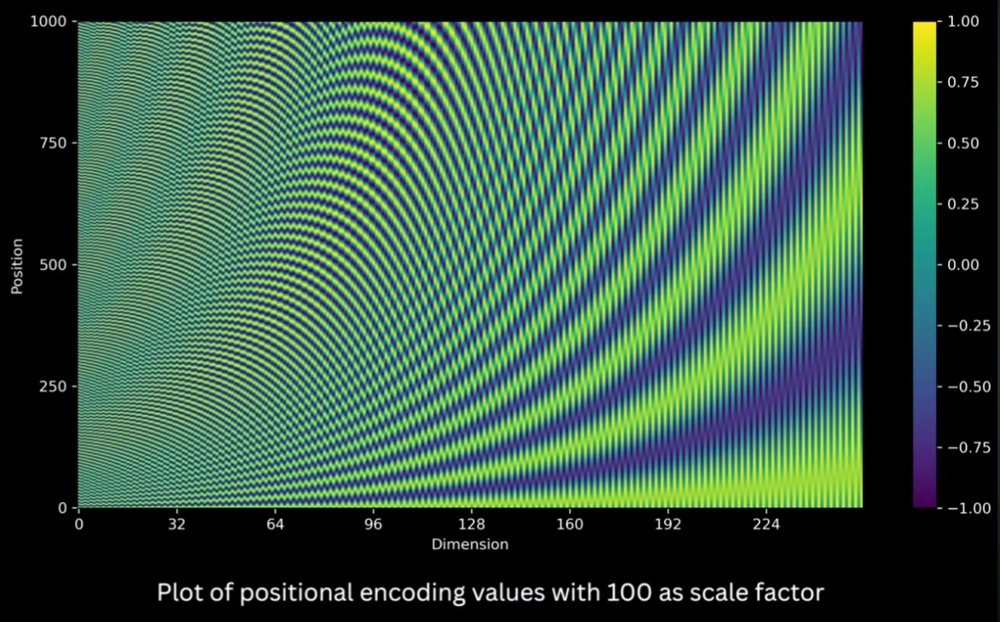
  <figcaption></figcaption>
</figure>

- For example lets calculate cosine similarity between PE[128:256] of 500th position to everyone other position.
- The cosine similarity will change drastically as we can see in the below figure, whereas we want higher dimensions to change smoothly.

<figure style="text-align: center;">
  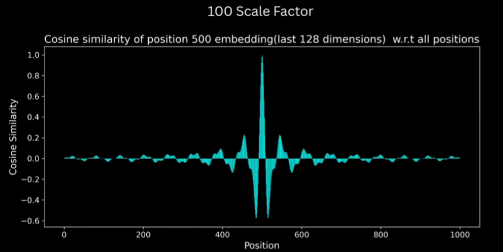
  <figcaption></figcaption>
</figure>

- The cosine similarity between PE[0:128] of 500th position to everyone other position.
- The cosine similarity decreases drastically to zero even with position difference of 10 only, whereas we want it to decrease smoothly but not in an aggressive way.

<figure style="text-align: center;">
  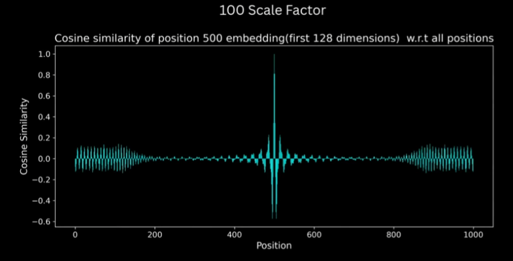
  <figcaption></figcaption>
</figure>

## What happens if we chose 100000
- And if we chose 100K as scaling factor then from below figure we can see that even the earlier dimensions have reduced frequency and thus we can't differentiate between two local positions

<figure style="text-align: center;">
  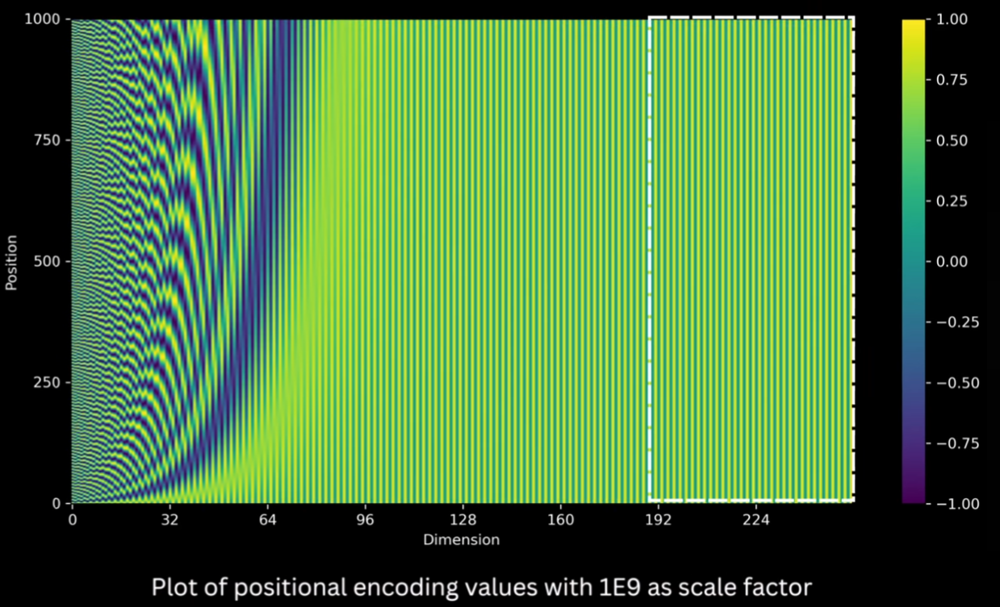
  <figcaption></figcaption>
</figure>

- For example lets calculate cosine similarity between PE[128:256] of 500th position to everyone other position, in this case similarity barely changes as we can see from below figure.

<figure style="text-align: center;">
  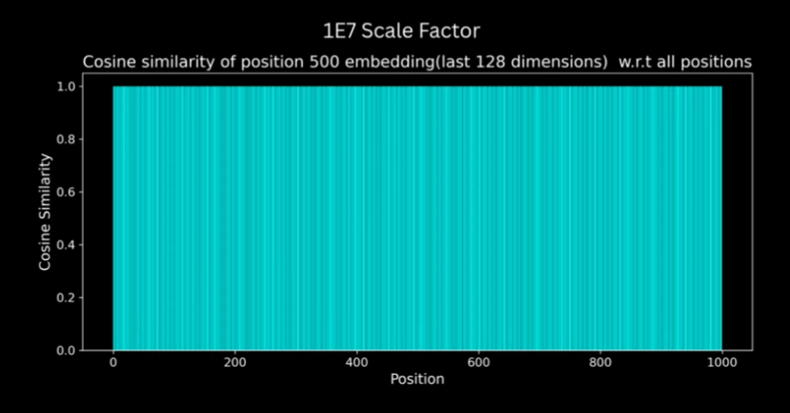
  <figcaption></figcaption>
</figure>

- The cosine similarity between PE[0:128] of 500th position to everyone other position.
- The cosine similarity remains mostly same even with position difference of 50, whereas we want it to decrease smoothly.

<figure style="text-align: center;">
  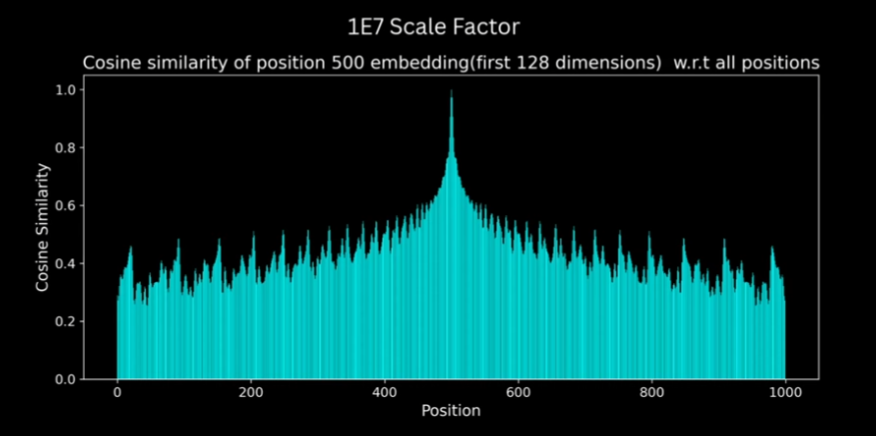
  <figcaption></figcaption>
</figure>

## How does 10k solves above problems
- And as suggested in paper, if we chose 10k. It is something like sweet spot where earlier dimensions have higher frequency thus helping in distinguishing between local positions and later dimensions have lower frequency thus helping in capturing long range positional differences.

<figure style="text-align: center;">
  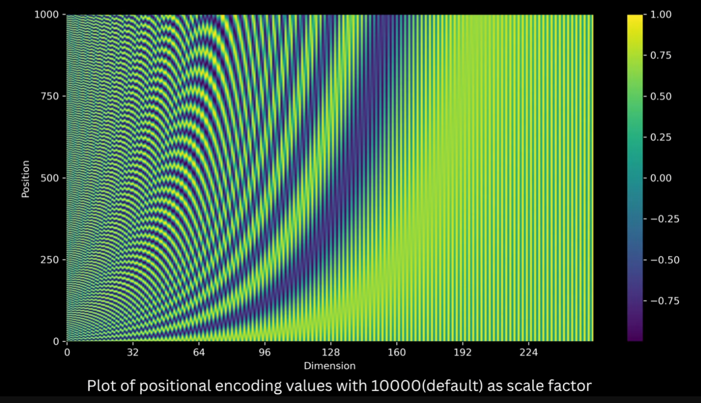
  <figcaption></figcaption>
</figure>

- As we can see from below graphs it solves the problem of cosine similarity between PE of 500th position and every other position

<figure style="text-align: center;">
  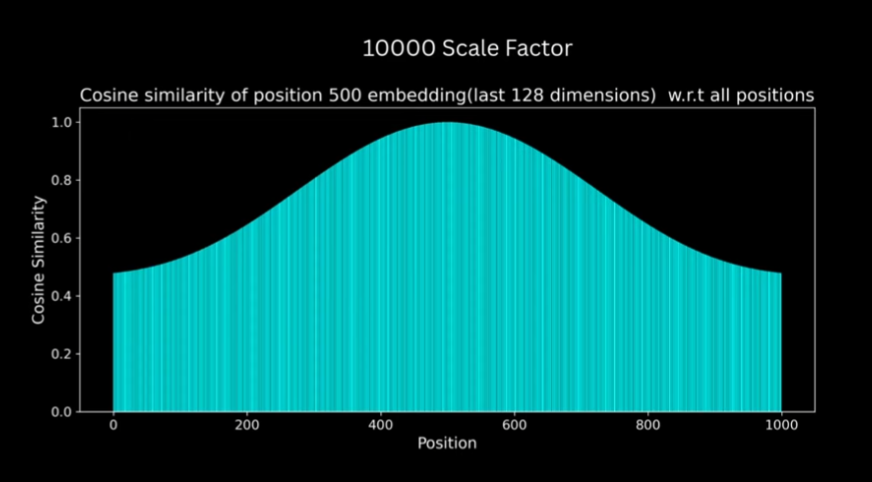
  <figcaption>Higher dimension similarity changes smoothly to capture global information</figcaption>
</figure>

<figure style="text-align: center;">
  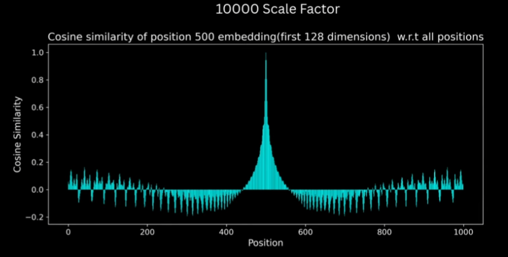
  <figcaption>Lower dimension similarity changes somewhat aggressively to capture local information</figcaption>
</figure>

# Why include cosine also
- It allows, the PE across all positions to have simple linear relationship.
- Generally:
  -  x = $\cos(\theta)$
  - y = $\sin(\theta)$
- But in paper:
  - x = $\sin(\theta)$
  - y = $\cos(\theta)$
  
<figure style="text-align: center;">
  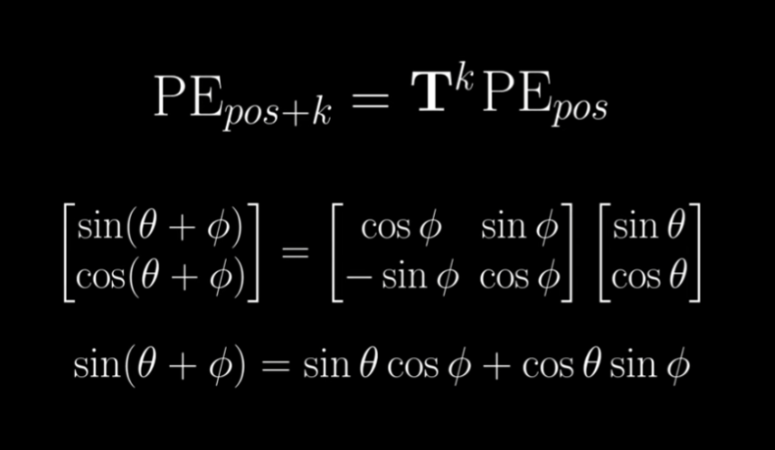
  <figcaption></figcaption>
</figure>

<figure style="text-align: center;">
  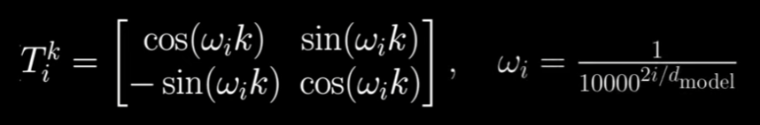
  <figcaption></figcaption>
</figure>

<figure style="text-align: center;">
  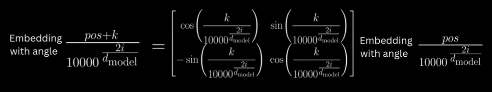
  <figcaption></figcaption>
</figure>

- As we can see from above equations, PE[pos+k] = $T_{k}$ PE[pos]
