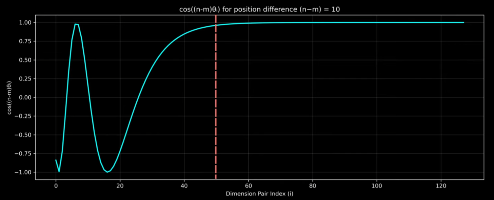
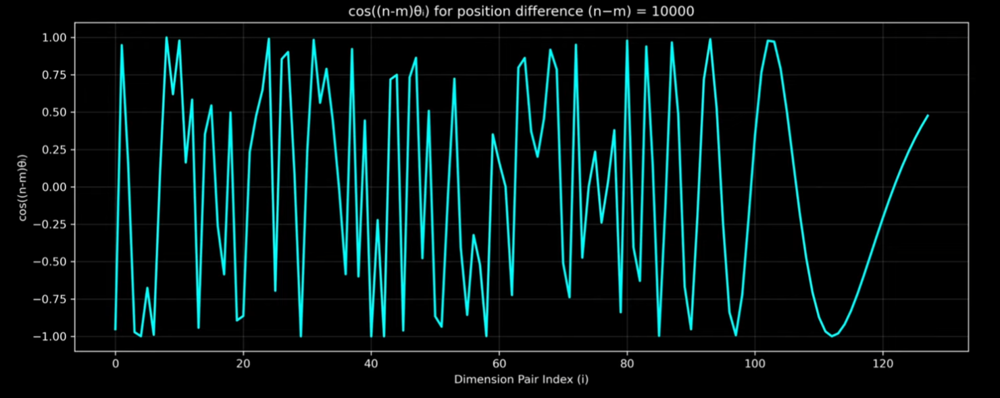
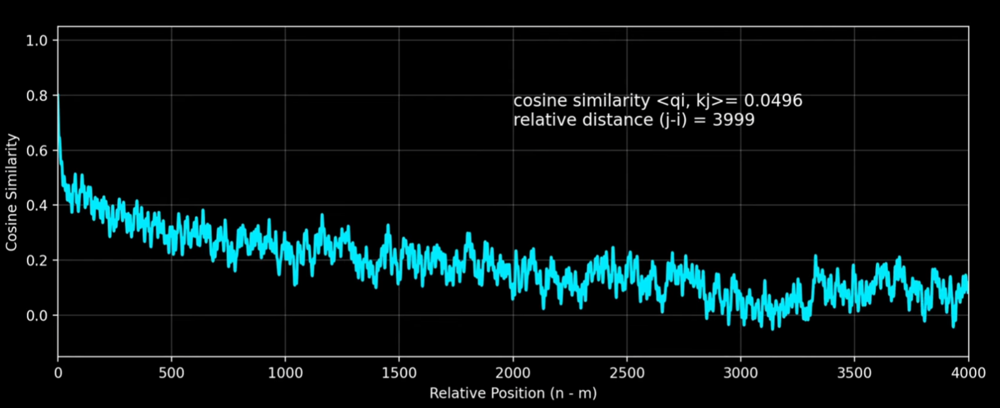
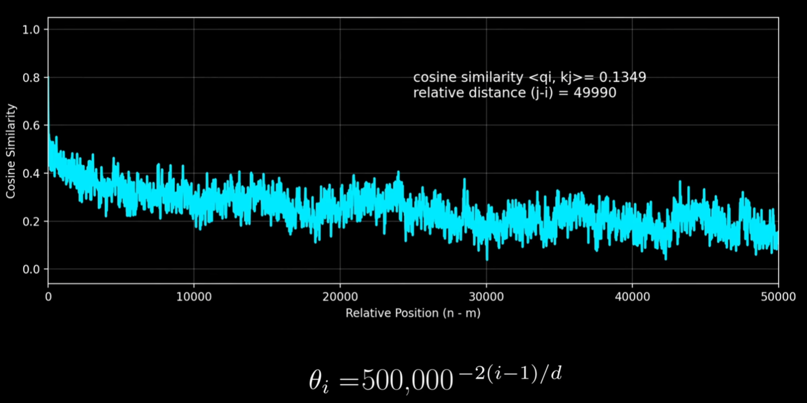

- In this post we will try to understand RoPE.
- This is mostly based on [Why Rotating Vectors Solves Positional Encoding in Transformers](https://www.youtube.com/watch?v=qKUobBR5R1A)


## Why Relative Position Embedding?
- It captures how two tokens are positioned with respect to each other
- For Example:-
  - ```text
    my daughter called her brother last night  [Sentence:-1]
    0     1 (n)  2 (m)  3    4      5     6
    ```
  - Absolute Position Embedding of token daughter depends on position of token i.e. 1 (n)
  - Relative Position Embedding of token 'daughter' with respect to token 'called' -1 (n-m)
    - Where -1 or in general it will tell whether token 'daughter' is before or after 'called' and at what distance.

- Query at position m attends Key at position n and to calculate attention score, it depends more on relative position than absolute position.
- ```text
  last night my daughter called her brother  [Sentence:-2]
  0      1    2    3        4    5     6
  ```
- In above sentence even though the APE is different compared to previous sentence their RPE is still the same

- In case of APE, there is linear relationship between tokens at pos and pos + k, and we expect our model to learn this relationship
  - $PE_{pos + k}$ = $T^k$ * $PE_{pos}$
- In case of RPE, we are explicitly telling our model that these two tokens are at k tokens apart

- Below table defines a summary of APE vs RPE

| Sentence  | APE                                | RPE                                                                 |
|:---------:|:----------------------------------:|:-------------------------------------------------------------------:|
| 1         | tokens are at 1st and 2nd Position | tokens are at (-1) tokens apart, where daughter comes before called |
| 2         | tokens are at 1st and 2nd Position | tokens are at (-1) tokens apart, where daughter comes before called |

- As we can generalise from above table that the two tokens which generally comes together or at k tokens apart, RPE will be same in such cases whereas in case of APE, it will differ for each sentence which model have to learn to generalise better
- So instead of saying i am at this position or that position, it would be better to explicitly mention that we are at k tokens apart

# RoPE

- Let's say we have a 2D vector and we want to rotate it by angle $\theta$, where it was earlier at $\alpha$ with magnitude r
- We can write initial $x$ and $y$ as:
  - $x$ = $r*\cos(\theta)$
  - $y$ = $r*\sin(\theta)$
- If we rotate it by $\alpha$, then:
  - $x'$ = $r*\cos(\theta + \alpha)$ = $r(\cos(\theta)\cos(\alpha) - \sin(\theta)\sin(\alpha))$
  - $y'$ = $r*\sin(\theta + \alpha)$ = $r(\sin(\theta)\cos(\alpha) + \cos(\theta)\sin(\alpha))$

- If we represent:
  $$
  R(\theta) = \begin{bmatrix}
  \cos(\theta) & -\sin(\theta) \\
  \sin(\theta) & \cos(\theta) \\
  \end{bmatrix}
  $$

  $$
  z' = \begin{bmatrix}
  x' \\
  y' \\
  \end{bmatrix}
  $$

  $$
  z = \begin{bmatrix}
  x \\
  y \\
  \end{bmatrix}
  $$

- Then we can write
  $z' = R(\theta)z$

- Below two properties which will be used later:
  - $R(-\theta)$ = $R(\theta)^T$ which gives
  - $R(\theta)^T$ $R(\theta)$ = I [Identity Matrix] 
  - $R(\theta_{1})$ $R(\theta_{2})$ = $R(\theta_{1} + \theta_{2})$

- RoPE rotates the embeddings
- Let's say q(query) at m and k(key) at n
- Then dot product between q and k would be
  - $(R(m\theta)q_{m})^TR(n\theta)k_{n}$
  - = $q_{m}^TR(m\theta)R(n\theta)k_{n}$
  - Since $R(-\theta)$ = $R(\theta)^T$, so $R(-m\theta)$ = $R(m\theta)^T$
  - this gives $q_{m}^TR(-m\theta)R(n\theta)k_{n}$
  - now since $R(\theta_{1})$ $R(\theta_{2})$ = $R(\theta_{1} + \theta_{2})$
  - this gives $q_{m}^TR((n-m)\theta)k_{n}$
  - In above eqn attention score now explicitly depends on relative distance between q and k
  - So if relative distance changes then only this factor will change

### Implementation
- Treat a pair as single 2D vector space and rotate it independently
- For example lets say we have d_model of 256 then we will have 128 2D vectors and we can rotate those pairs independently as shown in below table


| Pairs  | Rotation Matrix                                | 
|:---------:|:----------------------------------:|
| $(e_{1}, e_{2})$         | $R(m\theta_{1})$|
| $(e_{3}, e_{4})$         | $R(m\theta_{2})$|
| .................        | ............|
| .................       | ............|
| $(e_{d_{model}/2-1}, e_{d_{model}/2})$         | $R(m\theta_{d_{model}/2})$|

- where
  - $e_{k}$ is embedding value at index k
  - $\theta_{i}$ is rotation angle given as $\theta_{i}$  = $10000^{-2(i-1)/d_{model}}$, where i runs from 1 to $d_{model}/2$
  - $\theta_{i}$ decreases as i increases, so initial embedding values are rotated by large angles as compared to later embedding values

- Below is the code to get $(R(\theta)$ and also validate if $R(\theta)^T$ $R(\theta)$ = I [Identity Matrix]
- For simplicity, i have just printed a single matrix
```{python}
import torch

def get_RoPE(pos, d_model):
    theta = torch.tensor([10000**(-2*(i-1)/d_model) for i in range(1, d_model//2+1)])
    bsz, seq_len= pos.shape
    cos = torch.cos(pos[:, :, None]* theta[None, :]).view(bsz, seq_len, d_model//2)
    sin = torch.sin(pos[:, :, None]* theta[None, :]).view(bsz, seq_len, d_model//2)
    row1 = torch.stack([cos, -sin], dim=-1)
    row2 = torch.stack([sin, cos], dim=-1)

    RTheta = torch.stack([row1, row2], dim=-2)
    return RTheta

bsz = 2
tokens = torch.tensor([[2, 3] for _ in range(bsz)])
d_model = 256

RTheta = get_RoPE(tokens, d_model)

matrix = torch.matmul(RTheta, RTheta.transpose(-1, -2))

matrix[0][0][0]

```

- Below Code shows how to integrate RoPE while calculating attention

```{python}
import torch
import torch.nn as nn

class SimpleAttention(nn.Module):
    def __init__(self, d_model, hidden_dim):
        super().__init__()
        self.hidden_dim = hidden_dim
        self.q = nn.Linear(in_features = d_model, out_features = hidden_dim)
        self.k = nn.Linear(in_features = d_model, out_features = hidden_dim)
        self.v = nn.Linear(in_features = d_model, out_features = hidden_dim)
    
    def forward(self, x, rotary_emb):
        bsz, seq_len, d_model = x.shape
        query = self.q(x)
        key = self.k(x)
        value = self.v(x)

        if rotary_emb is not None:
            bsz, seq_len, d_model = x.shape
            query = query.view(bsz, seq_len, self.hidden_dim//2, 2, 1)
            key = key.view(bsz, seq_len, self.hidden_dim//2, 2, 1)
            query =  torch.matmul(rotary_emb, query).view(bsz, seq_len, self.hidden_dim)
            key =  torch.matmul(rotary_emb, key).view(bsz, seq_len, self.hidden_dim)
        
        scores = torch.softmax(torch.matmul(query, key.transpose(-1, -2))/(self.hidden_dim**2), dim=-1)
        final = torch.matmul(scores, value)
        return final

bsz = 2
tokens = torch.tensor([[2, 3] for _ in range(bsz)])
d_model = 256
embedding = torch.randn(*tokens.shape, d_model)

RTheta = get_RoPE(tokens, d_model)

model = SimpleAttention(d_model, d_model)

out = model(embedding, RTheta)
print(out.shape)
```
### The 10000
- As relative distance increases, the contribution of later dimension of embedding also increases in attention calculation.
  - For example, for smaller relative distance, the earlier dimensions only change but not the later ones as we can see in below figure, thus only earlier dimensions contribute to attention
  <figure style="text-align: center;">
  
  <figcaption></figcaption>
  </figure>
  - for larger relative distance, later dimensions also get under significant modification as we can see in below figure, thus earlier as well as later dimensions contribute to attention
  <figure style="text-align: center;">
  
  <figcaption></figcaption>
  </figure>
- Why 10000?
  - If we chose some smaller value, then even later dimensions gets modified aggressively for smaller relative distances and thus changing the attention score aggressively
  - If we chose some larger value then even earlier dimensions didn't get modified for larger relative distances and thus attention does not change much at all, the relative distance must need to be much larger for significant contribution to attention.
  - Basically this calculates how quickly attention gets sensitive to relative positional difference
  - As relative distance increases, the cosine similarity decreases [Attention Decay], and this is what we want, closer tokens attend to each other more than tokens far apart from each other as we can see from below figure.
  <figure style="text-align: center;">
  
  <figcaption></figcaption>
  </figure>

- Llama 3 used 500,000 as base frequency stating that it will lower the attention decay and thus model will be able to attend far apart tokens more meaningfully 
- As we can see in below figure, cosine similarity decreases very smoothly, thus will help in case of longer contexts
  <figure style="text-align: center;">
  
  <figcaption></figcaption>
  </figure> 
- It was believed that due to this attention decay, RoPE works very well

- But [Round and Round We Go! What makes Rotary Positional Encodings useful?](https://arxiv.org/abs/2410.06205) finds out something else is working under the hood which makes rope good at positional encoding.
  - They found out that this decay happens only in specific scenarios
  - If two embeddings had negative cosine similarity then instead of decreasing they might increase.
  - So what makes rope good
    - Lower Dimension Embeddings : High Frequency
    - Later Dimension Embeddings : Low Frequency
    - Low frequency dimensions dominate the attention dot product, whereas high frequency dimensions rotates heavily thus heavily dominated by positional information.
    - Semantic heads rely heavily on low frequency dimensions as a result even if distance increases, it has minimal impact on semantic dot product in case of long context if we chose 500k
    - If we have long context and base frequency is 10k then it is possible that for large position difference even the low frequency dimensions might have gone under aggressive transformation, thus heavily impacting the semantic attention
    - And if we chose 500k then the low frequency dimensions will not go under heavy rotation thus preserving the semantic meaning and helping to cover long range context
  - So we can say that:
    - High Frequency means positional information encoding.
    - Low Frequency means semantic information encoding.
