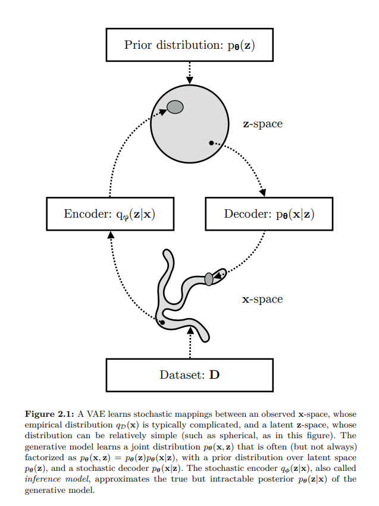
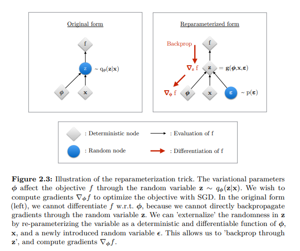

- This is mostly based on [Understanding Variational Autoencoder](https://www.youtube.com/watch?v=1RPdu_5FCfk) and [Variational Autoencoder - Model, ELBO, loss function and maths explained easily](https://www.youtube.com/watch?v=iwEzwTTalbg)


---

# Autoencoders
- They are used for:-
  - converting higher dimension to lower dimension
  - Representation Learning

## Cons of Autoencoders
- The encoded values can be used as representation but deep down they don't have any meaningful information.
- There is no semantic relationship between encoded data points like zebra or cat or tomato. They will be encoded but there will not be any similarity.
- Since everything is being encoded to the points, not distribution, we can not sample any new data point

---

# What We Actually Want?
- Instead of encoding to data points, encode into some distribution so that we can generate new data points.
- But even if we try to encode to a distribution, the model will again try to memorise things as it just have to minimize the reconstruction loss.
- Get variations in reconstructed images.
- So we want is that:
  - There should be some sort of latent distribution which is just not encoded to points, it should be wide enough to capture entire latent space so that we can have higher variance and thus variation in reconstructed images.
  - And also distributions should not be far apart from each other so that if we sample any latent then it should give us something meaningful not random images.

---

# How Do We Achieve Above Requirements?
- Gaussian distribution would help in achieving above objectives
  - It will try to have **mean as close to zero** as possible thus keep distributions closer to each other.
  - It will try to have **unit variance** thus ensuring that distributions have higher variance and hence disable the network to collapse distributions to a point. 

- So basically what we want is that our **encoded distribution** should look like a **Gaussian distribution**.
- We can use some sort of metric that will help in keeping the **encoded distribution** and **Gaussian distribution** as similar as possible.
- And that metric is **KL-Divergence**, which we can use to do so.


---

# Before Moving Forward Some Prerequisites

## Probability vs Likelihood
- You can check out [In Statistics, Probability is not Likelihood](https://www.youtube.com/watch?v=pYxNSUDSFH4) for the same.
- Consider the weights of mice

### Probability
- Let's say we have plotted all the weights which gives us mean 32 and std 2.5, now what is the probability of having a mouse which has weight between 32-34 is given by area under the curve
- $P(weight b/w 32-34 | mean=32, std=2.5)$

### Likelihood
- Considering we have fixed data/samples what is the likelihood of the current mean and std, which is given by the value corresponding to given weight on Y-axis.
- Basically in this case we will have a continuous distribution with mean as 32 and std as 2.5 and then we will found out what is the likelihood of having 34 as weight.
- $L(mean=32, std=2.5 | weight=34)$

- While training we try to maximize the likelihood for our data points so that our model can represent the data samples as closely as possible
- During inference, we check the probability of given sample based on the params(mean and std) we have learned while maximizing the likelihood.

## Some Maths
- The expectation $\mathbb{E}[x] = \int x \, p(x) \, dx$ gives the mean. where $x$ is value and $p(x)$ is probability density and $dx$ is tiny interval.
- Simply we can say that it is long run average for continuous random variable x where x∼p(x).
- Similarly $\mathbb{E}[f(x)] = \int f(x) \, p(x) \, dx$
  - $f(x) = x^2$  then $\mathbb{E}[x^2] = \int x^2 \, p(x) \, dx$

- Similarly for discrete one is:
  - $\mathbb{E}[X] = \sum_{x} x \, p(x)$, where $x$ is value and $p(x)$ is probability.

- Chain rule of probability
  $p(x, y) = p(x|y)p(y) = p(y|x)p(x)$

- Bayes' Theorem
  - $P(x \mid y) = \frac{P(y \mid x) \, P(x)}{P(y)}$

- Kullback Leibler Divergence
  - It allows to measure the distance between two probability distributions.
  - $D_{\text{KL}}(P \| Q) = \int_{-\infty}^{\infty} p(x) \log \frac{p(x)}{q(x)} \, dx$
  - Properties:-
    - Not symmetric i.e. $D_{\text{KL}}(P \| Q) \neq  D_{\text{KL}}(Q \| P) $
    - $D_{\text{KL}}(P \| Q) \geq 0$
    - $D_{\text{KL}}(P \| Q) = 0$ if $P=Q$

## Monte Carlo Estimation
- It is a way to approximately compute expected value.
- $\mathbb{E}_{x \sim p}[g(x)] = \sum_{x} g(x) \, p(x)$
- To get approximate expected value
  - Sample T IID(Independent and Identically Distributed) samples from P
  - estimate expected value as:
    - $\hat{g}(x_{1}....x_{T}) \triangleq \frac{1}{T}\sum_{t=1}^{T} g(x_{t})$

## Monte Carlo Gradient Estimation
- Similarly it is a way to estimate gradients when the objective contains an expectation over random variables.

---

# Let's Define Our Model

## Likelihood as Marginalization

- We can define the likelihood of our data as the marginalization over the joint probability with respect to the latent variable
  - $p(x) = \int p(x, z) dz = \int p(x|z)p(z)dz$
  - Now what does above line means
    - Consider we have only a single image and there are 3 latent codes which might have produced x then
    - $p(x) = p(x|z_1)p(z_1) + p(x|z_2)p(z_2) + p(x|z_3)p(z_3)$
    - Using chain rule we can write above equation as 
    - $p(x) = p(x, z_1) + p(x, z_2) + p(x, z_3)$
    - So what if we have infinitely many z, so above formula to incorporate all z

## Why It Is Intractable

- But it is intractable because we would need to evaluate this integral over all latent variables $z$ because it is of very high dimension.
- Intractable Problem:- A problem that can be solved in theory (e.g. given large but finite resources, especially time), but for which in practice any solution takes too many resources to be useful is known as intractable problem.
  - Like guessing the wi-fi password of your neighbour. In theory you can generate all the possible combinations but it will take years.

- In theory it is possible but practically it is not or we can use the chain rule of probability
  - $p(x) = \frac{p(x, z)}{p(z|x)}$
- We don't have ground truth $p(z|x)$ which is also what we are trying to find.

- Now it seems like chicken and egg problem like which came first
- We want to calculate $p(x)$ which depends on $p(z|x)$ and $p(z|x)$ depends on $p(x)$

## Approximate Posterior

- Usually, when we can't find something we try to approximate it
  - $p_{\theta}(z|x) \approx q_{\phi}(z|x)$
  - Where $p_{\theta}(z|x)$ is our true posterior(because we already assumed that $z$ is from Normal distribution so $p(z)$ is prior, and now given image x our assumption about z has changed for example if image was of face then now z might have some dimensions activated for face) parameterized by $\theta$ that we can't evaluate due to its intractability and $q_{\phi}(z|x)$ is an approximate posterior parameterized by $\phi$

## Let's Do Some Maths

### Introducing $q_{\phi}(z|x)$

- ${\log}p_{\theta}(x) = {\log}p_{\theta}(x)$
- $= {\log}p_{\theta}(x)$ x 1 Multiply by 1
- $= {\log}p_{\theta}(x) \int q_{\phi}(z|x) dz$. Since $\int q_{\phi}(z|x) dz = 1$. because summation of all the z that could have produced x is 1, which is what we are trying to calculate. You can take analogy of discrete example also $p(z_1|x) + p(z_2|x) = 1$ if we consider only z which could have produced x.
- $= {\int\log}p_{\theta}(x)  q_{\phi}(z|x) dz$  bring ${\log}p_{\theta}(x)$ inside integral since it does not depend on z and can be treated as constant.
- $= \mathbb{E}_{z \sim q_{\phi}(z|x)}[{\log}p_{\theta}(x)]$ 
  - basically above term is equal to  ${\log}p_{\theta}(x)$ but we want to somehow introduce z because  ${\log}p_{\theta}(x)$ is independent of z and using $\mathbb{E}[x] = \int constant \, p(x) \, dx$ is constant because we can take constant outside and the remaining integral will give 1.
- $= \mathbb{E}_{z \sim q_{\phi}(z|x)}[{\log}\frac{p_{\theta}(x, z)}{p_{\theta}(z|x)}]$   Apply the equation $p_{\theta}(x) = \frac{p_{\theta}(x, z)}{p_{\theta}(z|x)}$
- $= \mathbb{E}_{z \sim q_{\phi}(z|x)}[{\log}\frac{p_{\theta}(x, z)q_{\phi}(z|x)}{p_{\theta}(z|x)q_{\phi}(z|x)}]$  Multiply by 1
- $= \mathbb{E}_{z \sim q_{\phi}(z|x)}[{\log}\frac{p_{\theta}(x, z)}{q_{\phi}(z|x)}] + \mathbb{E}_{z \sim q_{\phi}(z|x)}[{\log}\frac{q_{\phi}(z|x)}{p_{\theta}(z|x)}]$  Split the expectation
- $= \mathbb{E}_{z \sim q_{\phi}(z|x)}[{\log}\frac{p_{\theta}(x, z)}{q_{\phi}(z|x)}] + D_{\text{KL}}(q_{\phi}(z|x) \| p_{\theta}(z|x))$ By definition of KL Divergence
- ${\log}p_{\theta}(x) = ELBO + D_{\text{KL}}(q_{\phi}(z|x) \| p_{\theta}(z|x))$ where **ELBO** is evidence lower bound and second term is KL divergence since it will always be greater than 0
- Since we are trying to maximize the likelihood then even if we maximize the first term i.e. **ELBO** that will work for us since second term will always be greater than 0
- For example
  - Total Compensation = Base Salary + Bonus($\geq 0$)
  - Total Compensation $\geq$ Base Salary
- Following the above analogy, we can also say that
  - ${\log}p_{\theta}(x) \geq \mathbb{E}_{z \sim q_{\phi}(z|x)}[{\log}\frac{p_{\theta}(x, z)}{q_{\phi}(z|x)}]$
  - So if we maximize the right side then left side will also be maximised

### Rewriting ELBO

- $\mathbb{E}_{z \sim q_{\phi}(z|x)}[{\log}\frac{p_{\theta}(x, z)}{q_{\phi}(z|x)}] = \mathbb{E}_{z \sim q_{\phi}(z|x)}[{\log}\frac{p_{\theta}(x|z)p_{\theta}(z)}{q_{\phi}(z|x)}]$ following chain rule of probability
- $\mathbb{E}_{z \sim q_{\phi}(z|x)}[\log{p_{\theta}(x | z)}] + \mathbb{E}_{z \sim q_{\phi}(z|x)}[{\log}\frac{p_{\theta}(z)}{q_{\phi}(z|x)}]$ Split the expectation
- $\mathbb{E}_{z \sim q_{\phi}(z|x)}[\log{p_{\theta}(x | z)}] -  D_{\text{KL}}(q_{\phi}(z|x) \| p_{\theta}(z))$ Using KL Divergence 
- So to maximize the whole term we need to maximize the first one and minimize the second term 
- Profit = Revenue - Costs
- To get maximum profit, we need to maximize revenue at the same time minimize the cost

<figure style="text-align: center;">
  
  <figcaption></figcaption>
</figure>


### What Maximizing ELBO Means

- Maximizing **ELBO** means:
  - **Maximizing the first term**: maximizing the reconstruction likelihood of the decoder
  - **Minimizing the second term**: minimizing the distance between learned distribution and the prior belief we have over the latent variable

- When we want to maximize a function then we move in the direction of gradient
- When we want to minimize a function then we move against the direction of gradient

- $L(\theta, \phi, x) = \mathbb{E}_{z \sim q_{\phi}(z|x)}[{\log}\frac{p_{\theta}(x, z)}{q_{\phi}(z|x)}]$   expectation over ${q_{\phi}(z|x)}$

::: {.callout-note}
In theory we maximize ELBO. In code, we usually minimize the negative ELBO, which becomes reconstruction loss plus KL loss.
:::


---

# Need of Reparameterization

## Why We Need It

- In case of VAEs, Monte Carlo gradient estimator exhibits high variance thus giving random gradient directions.
- The estimator is unbiased, meaning that even if at every step it may not be equal to the true expectation, on average it will converge to it, but as it is stochastic, it also has a variance and it happens to be high for practical use
- And also a sampling process can't be differentiated as in our case we are sampling from $z$ space to calculate loss

## Reparameterization Trick

- So we need a new estimator:- Let's just move the source of randomness outside the model
- Instead of directly sampling from $q_{\phi}(z|x)$, we rewrite sampling as 
  - z = $\mu_{\phi}(x) + \sigma_{\phi}(x)\epsilon$ where $\epsilon \sim \mathcal{N}(0, 1)$

<figure style="text-align: center;">
  
  <figcaption></figcaption>
</figure>

- $L(\theta, \phi, x) = \mathbb{E}_{p(\epsilon)}[{\log}\frac{p_{\theta}(x, z)}{q_{\phi}(z|x)}]$   expectation over ${p(\epsilon)}$
- $\epsilon \approx p(\epsilon)$
- $z = g(\phi, x, \epsilon)$
- $\tilde{L}(\theta, \phi, x) \overset{\sim}{=} \mathbb{E}_{p(\epsilon)}[{\log}\frac{p_{\theta}(x, z)}{q_{\phi}(z|x)}]$
- $\tilde{L}(\theta, \phi, x) = {\log}\frac{p_{\theta}(x, z)}{q_{\phi}(z|x)}$

## Final Estimator

- Finally the resulting estimator for this model considering data point $x^{(i)}$ is:
- $\mathcal{L}(\theta, \phi; \mathbf{x}^{(i)}) \simeq \frac{1}{2} \sum_{j=1}^{J} \left(1 + \log((\sigma_j^{(i)})^2) - (\mu_j^{(i)})^2 - (\sigma_j^{(i)})^2\right) + \frac{1}{L} \sum_{l=1}^{L} \log p_{\theta}(\mathbf{x}^{(i)} | \mathbf{z}^{(i,l)})$

- In above equation first term is KL-divergence and second term is Reconstruction loss(MSE)

::: {.callout-note}
MSE reconstruction loss comes from assuming a Gaussian decoder likelihood. If we assume a different decoder likelihood, the reconstruction loss can also change.
:::

# Code
- Below code is the simple implementation of how a VAE looks like in code
- Notice in case of encoder, we predict log of variance because neural network might give negative numbers also.

## VAE Model

```{python}
import torch
import torch.nn as nn
import torch.nn.functional as F

class VAE(nn.Module):
    def __init__(self):
        super().__init__()
        self.encoder = nn.Sequential(
            nn.Linear(28*28, 196),
            nn.Tanh(),
            nn.Linear(196, 48),
            nn.Tanh()
        )

        self.mu_fc = nn.Sequential(
            nn.Linear(48, 16),
            nn.Tanh(),
            nn.Linear(16, 2)
        )
        self.logvar_fc = nn.Sequential(
            nn.Linear(48, 16),
            nn.Tanh(),
            nn.Linear(16, 2)
        )
        self.decoder = nn.Sequential(
            nn.Linear(2, 16),
            nn.Tanh(),
            nn.Linear(16, 48),
            nn.Tanh(),
            nn.Linear(48, 196),
            nn.Tanh(),
            nn.Linear(196, 28*28),
            nn.Tanh()
        )
    
    def forward(self, x):
        ##Encoding
        mu, logvar = self.encode(x)

        ##Sampling

        z = self.sample(mu, logvar)

        ## Decoding
        x = self.decode(z)
        return mu, logvar, x
    
    def encode(self, x):
        x = x.reshape(x.shape[0], 28*28)
        x = self.encoder(x)
        mu, logvar = self.mu_fc(x), self.logvar_fc(x)
        return mu, logvar
    
    def decode(self, x):
        x = self.decoder(x)
        x = x.reshape(x.shape[0], 1, 28, 28)
        return x
    
    def sample(self, mu, log_var):
        rand = torch.randn_like(mu)
        std = torch.sqrt(torch.exp(log_var))
        return rand * std + mu

```

## Losses

- Below is the code on how to get KL loss and reconstruction loss

```{python}
def kl_loss(mu, log_var):
    return torch.mean(0.5 * torch.sum(torch.exp(log_var) + mu**2 - 1 - log_var, dim=-1))

def recon_loss(pred, target):
    return F.mse_loss(pred, target)
```


# Why VAEs Produce Blurry Samples
- Multiple possible images can correspond to similar latent representations. When many plausible images map to nearby latent regions, the decoder tends to generate an averaged reconstruction.
- This overlap occurs partly because of KL regularization, where the encoder is forced to keep latent representations close to a simple prior distribution (usually a Gaussian). As a result, different images may occupy overlapping regions in latent space.
- Additionally, VAEs typically assume the decoder output follows a Gaussian distribution:
  - $p(x|z) = \mathcal{N}(\mu_{\theta}(z), \sigma^2\mathbf{I})$
- Due to this assumption, maximizing likelihood becomes equivalent to minimizing Mean Squared Error (MSE) between the real and predicted image.
- Now suppose two possible pixel values for a region are 0 and 1 for similar latent vectors. Under MSE, the optimal prediction becomes their average:
  - $\frac{0+1}{2} = 0.5$

- Therefore, instead of producing one sharp possibility, the decoder learns to predict averaged pixel values across multiple plausible outputs, leading to blurry images.

---

# Summary
- Encoder learns $q_{\phi}(z|x)$
- Decoder learns $p_{\theta}(x|z)$
- KL-divergence keeps latent distribution close to prior distribution
- Reconstruction loss helps preserve input information
- Reparameterization helps backpropagate through sampling
