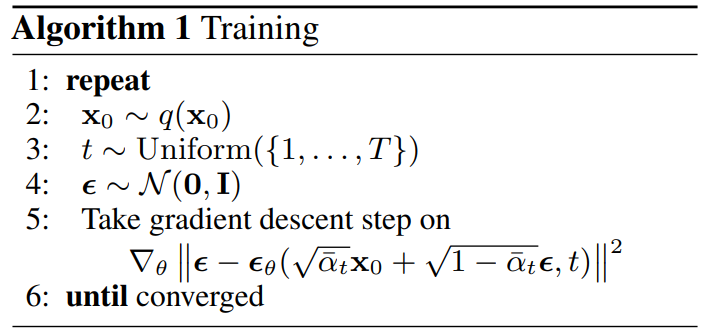
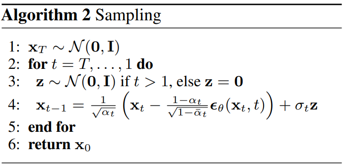

- This is mostly based on [Diffusion Models | Paper Explanation | Math Explained](https://www.youtube.com/watch?v=HoKDTa5jHvg&t=1409s) and [Stanford CME296 Diffusion & Large Vision Models | Spring 2026 | Lecture 1 - Diffusion](https://www.youtube.com/watch?v=tr-CUpw--ck)
- [Denoising Diffusion Probabilistic Models](https://arxiv.org/abs/2006.11239)
- [Denoising Diffusion Implicit Models](https://arxiv.org/abs/2010.02502)

- Minimal PyTorch implementation accompanying these notes:
  - [nanoDiffusion GitHub Repo](https://github.com/riteshrm/nanoDiffusion)
  
---

::: {.callout-note}
- [Forward Process](#forward-process)
- [Reverse Process](#reverse-process)
- [Implementation](#implementation)
- [Faster Sampling (DDIM)](#faster-sampling-denoising-diffusion-implicit-models)
:::

# Denoising Diffusion Probabilistic Models
- Denoising Diffusion Probabilistic Models operate within a variational framework, much like VAEs
- DDPMs introduce a clever twist that tackles some of the challenges faced by their predecessors

- DDPMs involve two most distinct stochastic processes:-
- The forward Pass (Fixed Encoder):
	- Gradually corrupts data by injecting gaussian noise over multiple steps via a transition kernel $q(x_t \mid x_{t-1})$
	- The data evolves into an isotropic gaussian distribution, effectively becoming pure noise
	- Encoder is fixed not learned.

::: {.callout-tip}
- iso means same and tropic means direction. This is often represented as identity matrix which signifies that noise is uncorrelated across all dimensions.
- pure noise means no identity of original data, only gaussian noise.
:::

	
- The reverse denoising process(Learnable Decoder):
	- A neural net learns to reverse the noise corruption through a parameterized distribution $p_{\theta}(x_{t-1}|x_{t})$
	- Starting from pure noise, this process iteratively denoises to generate realistic samples
	- Each individual denoising step is a more manageable task than generating a complete sample from scratch as VAEs often attempt to do
	
## Forward Process
- Forward process involves taking the noisy image from previous timestep and inject more noise
- **Forward transition kernel:** $q(x_{t} \mid x_{t-1}) = N(x_{t}, \sqrt{1-\beta_{t}}x_{t-1}, \beta_{t}I)$ where $x_{t}$ is output, $\sqrt{1-\beta_{t}}x_{t-1}$ is mean and $\beta_{t}I$ is variance
- Given $\beta_{t} \sim (0, 1)$, In paper $\beta_{start} = 0.0001$ and $\beta_{end} = 0.02$
- $q(x_{1}...x_{T} \mid x_{0}):= \prod_{t=1}^{T} q(x_t \mid x_{t-1})$
- **Noise injection form:** $x_{t} = \sqrt{1-\beta_{t}}x_{t-1} + \sqrt\beta_{t} \epsilon$ 
- lets say $\alpha_{t} = 1-\beta_{t}$
- Then $x_{t} = \sqrt\alpha_{t}x_{t-1} + \sqrt{1-\alpha_{t}} \epsilon$
- Lets say $\bar{\alpha}_{t}:= \prod_{t=0}^{T} \alpha_t$

| Symbol | Meaning |
|---|---|
| $\beta_t$ | noise schedule |
| $\alpha_t$ | $1-\beta_t$ |
| $\bar{\alpha}_t$ | $\prod_{t=0}^{T} \alpha_t$ |
| $\epsilon$ | gaussian noise |

- $x_{1} = \sqrt{\alpha_{1}}x_{0} + \sqrt{1-\alpha_{1}} \epsilon$
- $x_{2} = \sqrt{\alpha_{2}}x_{1} + \sqrt{1-\alpha_{2}} \epsilon$
- if we substitute value of $x_{1}$ in above equation then
- $x_{2} = \sqrt{\alpha_{2}}(\sqrt\alpha_{1}x_{0} + \sqrt{1-\alpha_{1}} \epsilon) + \sqrt{1-\alpha_{2}} \epsilon$
- $x_{2} = \sqrt{\alpha_{1}\alpha_{2}}x_{0} + \sqrt{\alpha_{2}(1-\alpha_{1})} \epsilon + \sqrt{1-\alpha_{2}} \epsilon$
- $x_{2} = \sqrt{\alpha_{1}\alpha_{2}}x_{0} + \sqrt{\alpha_{2}-\alpha_{1}\alpha_{2}} \epsilon + \sqrt{1-\alpha_{2}} \epsilon$

::: {.callout-tip}
- When we merge two normal distributions with different variance, the new distribution is as per below formula
	- $N(0, \sigma_{1}^2I) + N(0, \sigma_{2}^2I) = N(0, (\sigma_{1}^2 + \sigma_{2}^2)I)$
:::


- Using above intuition we can change accordingly the forward equation
- $\sqrt{\alpha_{2}-\alpha_{1}\alpha_{2}} \epsilon + \sqrt{1-\alpha_{2}} \epsilon = \sqrt{1-\alpha_{1}\alpha_{2}} \epsilon$
- $x_{2} = \sqrt{\alpha_{1}\alpha_{2}}x_{0} + \sqrt{1-\alpha_{1}\alpha_{2}} \epsilon$
- $x_{2} = \sqrt{\bar{\alpha}_{2}}x_{0} + \sqrt{1-\bar{\alpha}_{2}} \epsilon$
- If we generalize above equation it becomes
- $x_{t} = \sqrt{\bar{\alpha}_{t}}x_{0} + \sqrt{1-\bar{\alpha}_{t}} \epsilon$
	
## Reverse Process
### Reverse Transition (Parameterization)
- $p(x_{t-1}|x_{t}) = N(x_{t-1}; \mu_{\theta}(x_{t}, t), \epsilon_{\theta}(x_{t}, t))$
- Two neural networks to parameterize normal distribution $\mu_{\theta}$ and $\epsilon_{\theta}$
- In paper variance is fixed so we only need to predict mean
- We want to maximize the log likelihood of our data as we do in case of VAEs
- $log(p_\theta(x_{0}))$
- but it is not easily computable as it depends on all the other $x_{ts}$:- $x_0, x_1, x_2..x_T$
- So keeping track of other T-1 random variables is not possible as a solution we can compute ELBO as we did in VAEs


### Objective: Log-Likelihood and ELBO
- lets say when we have $f(x)$ and $g(x)$ and $f(x)$ > $g(x)$ for all x then if we can maximize $g(x)$ then $f(x)$ will also be maximized
- Using the above analogy, lets say $f(x) = log(p_\theta(x_{0}))$ and $g(x) = log(p_\theta(x_{0})) - D_{KL}(q(x_1:x_T \mid x_0) || p_{\theta}(x_1:x_T \mid x_0))$
- From above equations, we can see $f(x)$ and $g(x)$ are almost same, just there is one difference the KL-Divergence term which is being subtracted so if we are subtracting something then it is lesser than $f(x)$ and thus if we can somehow maximize $g(x)$ then we can maximize the likelihood of data samples
- $log(p_\theta(x_{0})) >= log(p_\theta(x_{0}))) - D_{KL}(q(x_1:x_T \mid x_0) || p_{\theta}(x_1:x_T \mid x_0))$
- Now we have to maximize $log(p_\theta(x_{0}))) - D_{KL}(q(x_1:x_T \mid x_0) || p_{\theta}(x_1:x_T \mid x_0))$

- Now our loss becomes negative of log likelihood
 $$-log(p_\theta(x_{0}))) + D_{KL}(q(x_1:x_T \mid x_0) || p_{\theta}(x_1:x_T \mid x_0))$$ {#eq-loss}
- Even now our loss still contains $p_\theta(x_{0})$ and to eliminate that we have to make some changes to KL term


### From KL Term to VLB (Step-by-step Expansion)
- Now lets focus on KL-term only
	- $D_{KL}(q(x_1:x_T \mid x_0) || p_{\theta}(x_1:x_T \mid x_0))$ = $log\frac{q(x_1:x_T \mid x_0)}{p_{\theta}(x_1:x_T \mid x_0)}$
	- the denominator in the above expression can be replaced using bayes' theorem
	- $p_{\theta}(x_1:x_T \mid x_0) = \frac{p_{\theta}(x_0 \mid x_1:x_T)p_{\theta}(x_1:x_T )}{p_{\theta}(x_0)}$
	- Numerator can be replaced by $p_{\theta}(x_0 , x_1:x_T)$ using joint probability.
	- Now $p_{\theta}(x_1:x_T \mid x_0) = \frac{p_{\theta}(x_0 , x_1:x_T)}{p_{\theta}(x_0)}$
	- where $p_{\theta}(x_0 , x_1:x_T)$ can be written as $p_{\theta}(x_0:x_T)$ full joint distribution of entire diffusion trajectory
	- Now putting back the denominator value in KL term as $\frac{p_{\theta}(x_0:x_T)}{p_{\theta}(x_0)}$ gives us
	- $log\frac{q(x_1:x_T \mid x_0)p_{\theta}(x_0)}{p_{\theta}(x_0:x_T)}$
	- If we expand above equation as:-
	- $log\frac{q(x_1:x_T \mid x_0)}{p_{\theta}(x_0:x_T)}$ + $log(p_{\theta}(x_0))$

- lets add above derived kl term in @eq-loss which gives
- $-log(p_{\theta}(x_{0})) + log\frac{q(x_1:x_T \mid x_0)}{p_{\theta}(x_0:x_T)} + log(p_{\theta}(x_0))$
- Notice $-log(p_{\theta}(x_{0}))$ gets cancelled with $log(p_{\theta}(x_0))$
- Now our loss function becomes: $log\frac{q(x_1:x_T \mid x_0)}{p_{\theta}(x_0:x_T)}$
- Which gives $-log(p_\theta(x_{0})) <= log\frac{q(x_1:x_T \mid x_0)}{p_{\theta}(x_0:x_T)}$  VLB

### VLB Expansion (Product to Summation)
- As we can see in VLB numerator is basically forward pass and denominator can be written as:
- $p_{\theta}(x_{0:T}) = p(x_T)\prod_{t=1}^{T} p_{\theta}(x_{t-1} \mid x_t)$ and $p(x_T)$ is simply normal distribution with mean 0 and std 1
- We can also write numerator as product of probabilities as $\prod_{t=1}^{T}q(x_{t} \mid x_{t-1})$
- Now our VLB becomes
- $log\frac{\prod_{t=1}^{T}q(x_{t} \mid x_{t-1})}{p(x_T)\prod_{t=1}^{T} p_{\theta}(x_{t-1} \mid x_t)}$
- Now take out $p(x_T)$ which gives
- $-log(p(x_T)) + log\frac{\prod_{t=1}^{T}q(x_{t} \mid x_{t-1})}{\prod_{t=1}^{T} p_{\theta}(x_{t-1} \mid x_t)}$
- Now we can transform product to summation which gives
- $-log(p(x_T)) + \sum_{t=1}^{T}log\frac{q(x_{t} \mid x_{t-1})}{p_{\theta}(x_{t-1} \mid x_t)}$
- Now from summation one take out t=1 formulation and keep everything as it is which gives
- $-log(p(x_T)) + \sum_{t=2}^{T}log\frac{q(x_{t} \mid x_{t-1})}{p_{\theta}(x_{t-1} \mid x_t)}+ log\frac{q(x_1 \mid x_0)}{p_{\theta}(x_0 \mid x_1)}$
- now the numerator in summation of logs can be written as:
- $q(x_t \mid x_{t-1}) = \frac{q(x_{t-1} \mid x_t)q(x_t)}{q(x_{t-1})}$

### Conditioning Trick: Reduce Variance with $x_0$
- Now all the three terms 2 in numerator and 1 in denominator have really high variance, since we dont know what we started from that's why author tried to reduce the variance by conditioning on x_0 and thus it reduces the choice of possible candidates. Intuitively given a noisy sample how can you say that what part do i have to remove, whereas if we also have x_0 then we might guess what part of noise to remove.
- So $q(x_t \mid x_{t-1}) = \frac{q(x_{t-1} \mid x_t, x_0)q(x_t \mid x_0)}{q(x_{t-1} \mid x_0)}$
- Notice If we have not taken out the t=1 term then there have been a loop as 
- $q(x_1 \mid x_0) = \frac{q(x_0 \mid x_1)q(x_1)}{q(x_0)} = \frac{q(x_0 \mid x_1, x_0)q(x_1 \mid x_0)}{q(x_0 \mid x_0)}$
- lets put back the value of $q(x_t \mid x_{t-1})$ back in original equation which gives
- $-log(p(x_T)) + \sum_{t=2}^{T}log(\frac{q(x_{t-1} \mid x_{t}, x_0)q(x_t \mid x_0)}{p_{\theta}(x_{t-1} \mid x_t)q(x_{t-1} \mid x_0)}) + log(\frac{q(x_1 \mid x_0)}{p_{\theta}(x_0 \mid x_1)})$
- lets expand summation one
- $-log(p(x_T)) + \sum_{t=2}^{T}log\frac{q(x_{t-1} \mid x_{t}, x_0)}{p_{\theta}(x_{t-1} \mid x_t)} + \sum_{t=2}^{T}log\frac{q(x_t \mid x_0)}{q(x_{t-1} \mid x_0)}+ log(\frac{q(x_1 \mid x_0)}{p_{\theta}(x_0 \mid x_1)})$
- the 3rd term in above equation if expanded is just $log\frac{q(x_T \mid x_0)}{q(x_1 \mid x_0)}$
- Now our loss looks like
- $-log(p(x_T)) + \sum_{t=2}^{T}log\frac{q(x_{t-1} \mid x_{t}, x_0)}{p_{\theta}(x_{t-1} \mid x_t)} + log\frac{q(x_T \mid x_0)}{q(x_1 \mid x_0)}+ log(\frac{q(x_1 \mid x_0)}{p_{\theta}(x_0 \mid x_1)})$
- lets open up the 3rd and 4th term over log
- $-log(p(x_T)) + \sum_{t=2}^{T}log\frac{q(x_{t-1} \mid x_{t}, x_0)}{p_{\theta}(x_{t-1} \mid x_t)} + log(q(x_T \mid x_0)) - log(q(x_1 \mid x_0)) + log(q(x_1 \mid x_0)) - log(p_{\theta}(x_0 \mid x_1)) $

- which gives us finally
- $log(\frac{q(x_T \mid x_0)}{p(x_T)}) + \sum_{t=2}^{T}log\frac{q(x_{t-1} \mid x_{t}, x_0)}{p_{\theta}(x_{t-1} \mid x_t)} - log(p_{\theta}(x_0 \mid x_1))$

### Final Loss Decomposition ($L_T$, $L_t$, $L_0$)
- Let's say 
	- $L_T = D_{KL}(q(x_T \mid x_0) || p(x_T))$
	- $L_t = \sum_{t=2}^{T}D_{KL}(q(x_{t-1} \mid x_t, x_0) || p_{\theta}(x_{t-1} \mid x_t))$
	- $L_0 = log(p_{\theta}(x_0 \mid x_1))$
- We can neglect $L_T$ since it does not involve any parameters
- For $L_t$
- Recall when we applied bayes' rule, due to that both forward and reverse process are in same form now
- Now lets focus on $L_t$ and $L_0$
- $p_{\theta}(x_{t-1} \mid x_t) = N(x_{t-1}; \mu_{\theta}(x_t, t), \epsilon_{\theta}(x_t, t))$
- since $\epsilon_{\theta}(x_t, t)$ is fixed which is $\beta_t I$
- $p_{\theta}(x_{t-1} \mid x_t) = N(x_{t-1}; \mu_{\theta}(x_t, t), \beta_t I)$
- $q(x_{t-1} \mid x_t, x_0)$ also has a closed form solution which is equal to 
- $N(x_{t-1}; \tilde{\mu_t}(x_t, x_0), \tilde{\beta_t}I)$
- For derivation check out [What are Diffusion Models?](https://lilianweng.github.io/posts/2021-07-11-diffusion-models/)
- But for now assume
	- $\tilde{\mu_t}(x_t, x_0) = \frac{\sqrt{\alpha_t}(1-\bar{\alpha}_{t-1})}{1-\bar{\alpha}_t}X_t + \frac{\sqrt{\bar{\alpha}_{t-1}}\beta_t}{1-\bar{\alpha}_t}X_0$
	- $\tilde{\beta_t} = \frac{1-\bar{\alpha}_{t-1}}{1-\bar{\alpha}_t}\beta_t$
	- Since \beta_t is fixed, we can neglect this
	
### Noise Prediction Reparameterization (Predict epsilon)
- from forward pass put the value of X_0 in $\tilde{\mu_t}$
- $x_{t} = \sqrt{\bar{\alpha}_{t}}x_{0} + \sqrt{1-\bar{\alpha}_{t}} \epsilon$
- from above equation 
- $x_{0} = \frac{x_{t} - \sqrt{1-\bar{\alpha}_{t}} \epsilon}{\sqrt{\bar{\alpha}_{t}}}$
- which gives
- $\tilde{\mu}(x_t, x_0) = \frac{1}{\sqrt{\alpha_t}}(x_t - \frac{\beta_t}{\sqrt{1-\bar{\alpha}_t}}\epsilon)$
- Our model needs to predict $\tilde{\mu}(x_t, x_0)$
- Since $x_t$ is available as input at training time, we can reparameterize the gaussian noise term instead to predict $\epsilon$ from input $x_t$ at time step $t$
- $\mu_{\theta}(x_t, t) = \frac{1}{\sqrt{\alpha_t}}(x_t - \frac{\beta_t}{\sqrt{1-\bar{\alpha}_t}}\epsilon_{\theta}(x_t, t))$
- $L_t = \frac{1}{2{\sigma_{t}}^2} MSE(\tilde{\mu_t}(x_t, x_0), \mu_{\theta}(x_t, t))$
- now comparing $\mu_{\theta}(x_t, t)$ and $\tilde{\mu_t}(x_t, x_0)$
- $L_t = \frac{{\beta_{t}}^2}{2{\sigma_{t}}^2\alpha_t(1-\bar{\alpha_t})} MSE(\epsilon, \epsilon_{\theta}(x_t, t))$
- Authors from the DDPM paper neglected the weighting term citing that it improves the sample quality and implementation is quite easy.
- So $L_t =  MSE(\epsilon, \epsilon_{\theta}(x_t, t))$
- Now for $L_0$
- Authors decided to neglect the last term but basically it was comparing with $x_0$, like how probable is the predicted $x_0$ given $x_1$
- By neglecting $L_0$, while generating sample, we add noise till $t>1$ but at $t=1$, we just return the sample

### Sampling Step ($x_{t-1}$ from $x_t$)
- Now back to starting sample generation
- $p_{\theta}(x_{t-1} \mid x_t) = N(x_{t-1}; \mu_{\theta}(x_t, t), \beta_{t}I)$, which gives
- $x_{t-1} = \mu_{\theta}(x_t, t) + \sqrt{\beta_{t}}\epsilon$
- now putting the value of $\mu_{\theta}(x_t, t)$ gives
- $x_{t-1} = \frac{1}{\sqrt{\alpha_{t}}}(x_t - \frac{\beta_t}{\sqrt(1-\bar{\alpha}_t)}\epsilon_{\theta}(x_t, t)) + \sqrt{\beta_{t}}\epsilon$

<figure style="text-align: center;">
  
  <figcaption>Training Algorithm</figcaption>
</figure>

<figure style="text-align: center;">
  
  <figcaption>Sampling Algorithm</figcaption>
</figure>

## Implementation
- Below is simple implementation of forward process, reverse process, sampling and loss, where eps_theta is our denoiser model
- For the complete class-conditioned DDPM implementation, check out:- [nanoDiffusion/ddpm.py](https://github.com/riteshrm/nanoDiffusion/ddpm.py)
```{python}
#| label: ddpm-reference-implementation
#| code-line-numbers: true
import torch
class Diffusion():
    def __init__(self, beta_start, beta_end, timesteps):
        self.beta_start = beta_start
        self.beta_end = beta_end
        self.timesteps = timesteps
        self.beta_t = torch.linspace(self.beta_start, self.beta_end, self.timesteps)
        self.alpha_t = 1- self.beta_t
        self.alphabar_t = torch.cumprod(self.alpha_t, dim=0)
        self.eps_theta = torch.nn.Module()

    def forward_process(self, x_0, eps, t):
        alphabar_t = self.alphabar_t[t].view(-1, 1, 1, 1)
        x_t = torch.sqrt(alphabar_t)*x_0 + torch.sqrt(1 - alphabar_t)*eps
        return x_t
    
    def reverse_process(self, x_t, t, eps=None):
        pred_eps = self.eps_theta(x_t, t)
        alphabar_t = self.alphabar_t[t].view(-1, 1, 1, 1)
        alpha_t = self.alpha_t[t].view(-1, 1, 1, 1)
        beta_t = self.beta_t[t].view(-1, 1, 1, 1)
        if eps is None:
            x_prevt = (1/torch.sqrt(alpha_t))*(x_t - (beta_t/torch.sqrt(1 - alphabar_t))*pred_eps)
        else:
            x_prevt = (1/torch.sqrt(alpha_t))*(x_t - (beta_t/torch.sqrt(1 - alphabar_t))*pred_eps) + torch.sqrt(beta_t)*eps
        return x_prevt
    
    def sample(self, shape):
        x_t = torch.randn(shape)
        
        for t in range(self.timesteps-1, -1, -1):
            if t==0:
                x_t = self.reverse_process(x_t, t)
            else:
                eps = torch.randn(shape)
                x_t = self.reverse_process(x_t, t, eps)
        return x_t
    
    def loss(self, x_0):
        t = torch.randint(0, self.timesteps, (x_0.shape[0],))
        eps = torch.randn_like(x_0)
        x_t = self.forward_process(x_0, eps, t)
        pred_eps = self.eps_theta(x_t, t)
        return torch.nn.functional.mse_loss(eps, pred_eps)
```

---

# Faster Sampling (Denoising Diffusion Implicit Models)
## Motivation: Fewer Steps than DDPM
- So DDPM is taking the same number of steps as in forward process to generate a sample.
- May be we can make larger jumps in reverse process, but the resultants are not good due to stochastic nature in DDPM reverse
- DDIM aims to follow a non-markovian process, which also keeps the marginal same as DDPM at the same avoiding stochasticity in reverse process
- Basically DDIM proposes q [$q_{\sigma}(x_{t-1} \mid x_t, x_0)$] such that
    - Marginal is same as DDPM :- $q_{\sigma}(x_{t} \mid x_0) = q(x_{t} \mid x_0)$
    - Generation process can be made deterministic:- $p_{\theta}(x_{t-1} \mid x_1)$ can be made deterministic

## DDIM Setup: Non-Markovian, Same Marginals
- Which gives
- $q_{\sigma}(x_{t-1} \mid x_t, x_0) = N(\sqrt{\bar{\alpha}_{t-1}}x_0 + \sqrt{1-\bar{\alpha}_{t-1}-\sigma_t^2}\frac{x_t - \sqrt{\bar{\alpha}_t}x_0}{\sqrt{1-\bar{\alpha}_1}}, \sigma_t^2I)$ 

## Deterministic Sampling (sigma = 0)
- After setting $\sigma = 0$, there will not be any stochasticity
- $p_{\theta}(x_{t-1} \mid x_1)  \triangleq q_{\sigma=0}(x_{t-1} \mid x_t, \hat{x_0}(t))$
- where $\hat{x_0}(t)$ is approximated $\hat{x_0}$ at every step
- $\hat{x_0}(t) = \frac{x_t - \sqrt{1-\bar{\alpha}_t}\epsilon_{\theta}(x_t, t)}{\sqrt{\bar{\alpha}_t}}$
- $x_{t-1} = \sqrt{\bar{\alpha}_{t-1}}\hat{x_0}(t) + \sqrt{1-\bar{\alpha}_{t-1}}\epsilon_{\theta}(x_t, t) + 0$
- Our prediction of the clean image from time t that we noise to time t-1 with no stochasticity

## Update Rule ($x_{\tau_{i-1}}$ from $x_{\tau_i}$)
- Lets generalize it
- $x_{\tau_{i-1}} = \sqrt{\bar{\alpha}_{\tau_{i-1}}}\hat{x_0}({\tau_{i}}) + \sqrt{1-\bar{\alpha}_{\tau_{i-1}}}\epsilon_{\theta}(x_{\tau_{i}}, \tau_{i})$

## Implementation
- For the complete class-conditioned DDIM implementation, check out:- [nanoDiffusion/ddim.py](https://github.com/riteshrm/nanoDiffusion/ddim.py)
```{python}
#| label: ddim-reference-implementation
#| code-line-numbers: true
import torch
class Diffusion():
    def __init__(self, beta_start, beta_end, timesteps):
        self.beta_start = beta_start
        self.beta_end = beta_end
        self.timesteps = timesteps
        self.beta_t = torch.linspace(self.beta_start, self.beta_end, self.timesteps)
        self.alpha_t = 1- self.beta_t
        self.alphabar_t = torch.cumprod(self.alpha_t, dim=0)
        self.eps_theta = torch.nn.Module()

    def forward_process(self, x_0, eps, t):
        alphabar_t = self.alphabar_t[t].view(-1, 1, 1, 1)
        x_t = torch.sqrt(alphabar_t)*x_0 + torch.sqrt(1 - alphabar_t)*eps
        return x_t
    
    def reverse_process(self, x_t, t, eps=None):
        pred_eps = self.eps_theta(x_t, t)
        alphabar_t = self.alphabar_t[t].view(-1, 1, 1, 1)
        alpha_t = self.alpha_t[t].view(-1, 1, 1, 1)
        beta_t = self.beta_t[t].view(-1, 1, 1, 1)
        if eps is None:
            x_prevt = (1/torch.sqrt(alpha_t))*(x_t - (beta_t/torch.sqrt(1 - alphabar_t))*pred_eps)
        else:
            x_prevt = (1/torch.sqrt(alpha_t))*(x_t - (beta_t/torch.sqrt(1 - alphabar_t))*pred_eps) + torch.sqrt(beta_t)*eps
        return x_prevt
    
    def sample_ddim(self, shape, num_steps):
        x_t = torch.randn(shape)

        steps = torch.linspace(self.timesteps-1, 0, num_steps, dtype=torch.int)

        for i in range(num_steps):
            t = steps[i]
            alphabar_t = self.alphabar_t[t].view(-1, 1, 1, 1)
            pred_eps = self.eps_theta(x_t, t)
            x_hat = (x_t - (1-alphabar_t).sqrt()*pred_eps)/alphabar_t.sqrt()
            if i == len(steps)-1:
                return x_hat
            prev_t = steps[i+1]
            alphabar_prevt = self.alphabar_t[prev_t].view(-1, 1, 1, 1)
            x_prevt = alphabar_prevt.sqrt()*x_hat + (1-alphabar_prevt).sqrt()*pred_eps
            x_t = x_prevt
    
    def loss(self, x_0):
        t = torch.randint(0, self.timesteps, (x_0.shape[0],))
        eps = torch.randn_like(x_0)
        x_t = self.forward_process(x_0, eps, t)
        pred_eps = self.eps_theta(x_t, t)
        return torch.nn.functional.mse_loss(eps, pred_eps)
```
