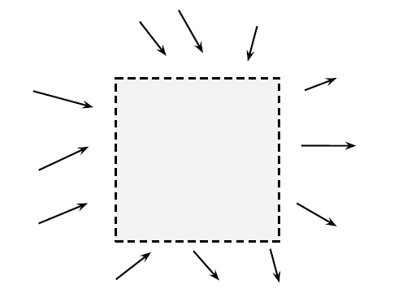
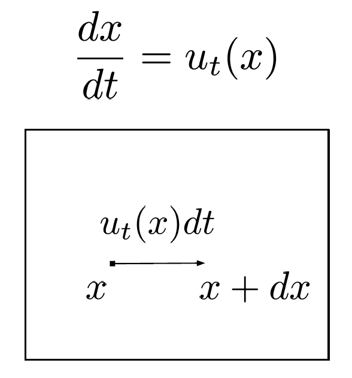
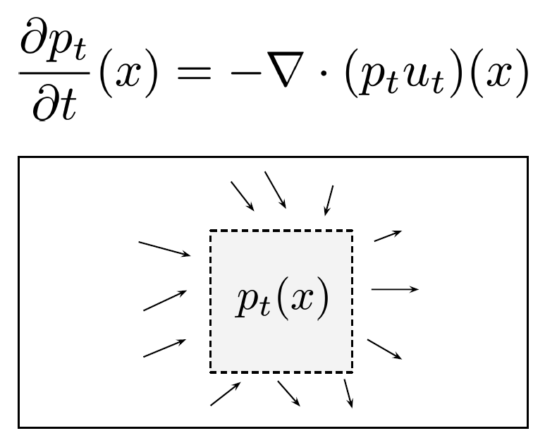
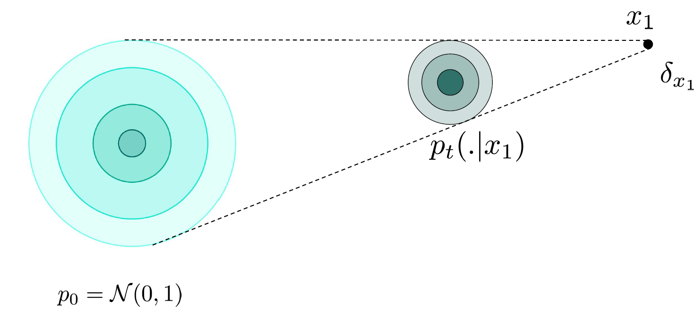
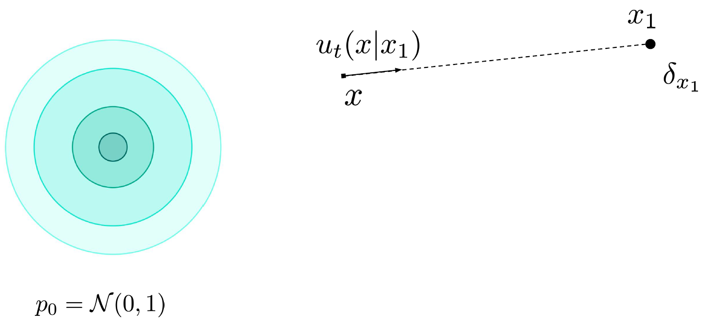
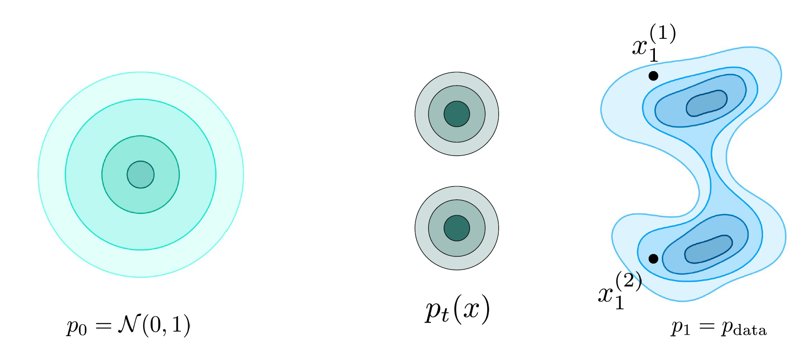
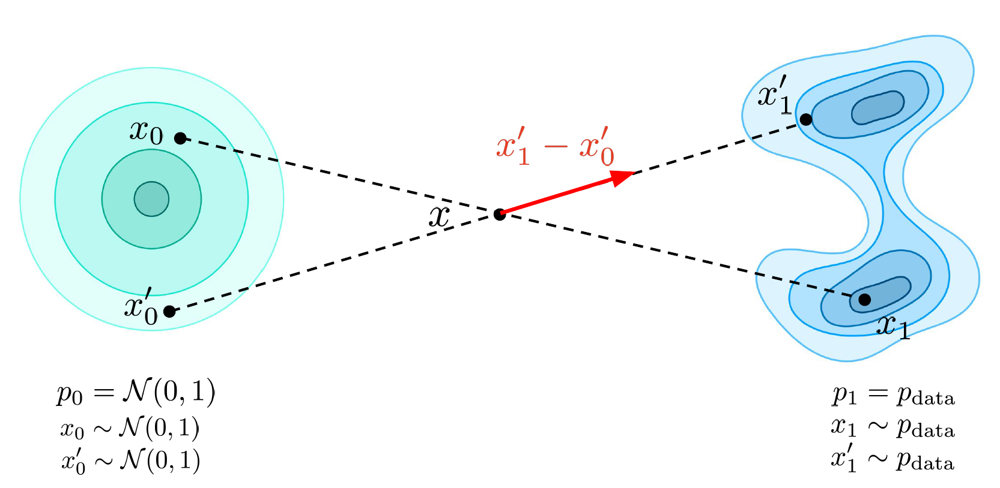
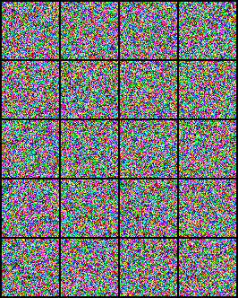

::: {.callout-tip}
### References
- This is mostly based on:
    1. [Stanford CME296 Diffusion & Large Vision Models | Spring 2026 | Lecture 3 - Flow matching](https://www.youtube.com/watch?v=agN3AlfGFrk)
    2. [Flow Matching | Explanation + PyTorch Implementation](https://www.youtube.com/watch?v=7cMzfkWFWhI)
    3. [Flow Matching for Generative Modeling](https://arxiv.org/abs/2210.02747)
:::

---

- Minimal PyTorch implementation accompanying these notes:
  - [nanoFM GitHub Repo](https://github.com/riteshrm/nanoFM)

::: {.callout-note}
### Reading map
- Motivation
- Flow Models
- Earlier attempts to learn the velocity
- Flow Matching
- Implementation
:::

---

## Motivation
### Objective and solution
- **Objective:** Given a complex data distribution how can we go from simple distribution to complex data distribution.
- **Solution:** Use vector field, which will guide to go towards target distribution $P_1 = P_{data}$ from initial distribution $P_0 = N(0, I)$

### Some terminology
- Trajectory $x_t$: path taken by the observation for time t $\epsilon$ [0, 1]
    - For example:
        - $x_0$: from $P_0$ to $P_1$
        - $x_t$: from $P_0$ to $P_t$

- Flow $\psi(x_0)$: Collections of trajectories $x_t$ which start from different $x_0$
- Probability path $p_t(x)$: Probability distribution of $x_t$ at time t.
- Vector field $u_t(x)$: where to move(direction, speed) at time t and location x

### Velocity vs Score
::: {.callout-note}
- Velocity is like giving instructions to self-driving car at point x and time t whereas score is like compass in the car, which tells where the high probability regions are.
:::

### Perspective of a single sample with ODE
- $dx = u_t(x)dt$
- where:
  - $dx$ is change in sample position
  - $u_t(x)$ is velocity field at location x and time t 
  - $dt$ is change in time

- Trajectory starting from $x_0$ ($u_t(x_0)$) is unique if velocity $u_t(x)$ is lipschitz continuous

::: {.callout-tip}
### Lipschitz Continuity
- A function f is lipschitz continuous, when we have some constant M, (x, y) from space of interest such that:
  - $||f(x) - f(y)|| \leq M.||x - y||$
  - which means f needs to be continuous but not in a very dramatic way
:::

### Perspective of a distribution via "Mass Conservation"
<figure style="text-align: center;">
  
  <figcaption></figcaption>
</figure>

::: {.callout-tip}
- $\frac{\delta p_t}{\delta t}(x) = Inflow of density - Outflow of density$
- Where:
  - $\frac{\delta p_t}{\delta t}(x)$ is temporal evolution of density at time t at a particular location
:::

### Intuition behind divergence in 1D
::: {.callout-note}
- divergence $\geq$ 0 (things are coming out more than coming in)
  - $\frac{\delta f}{\delta x} \geq 0$

- divergence $\leq$ 0 (things are coming in more than going out)
  - $\frac{\delta f}{\delta x} \leq 0$

- Generalization for n dimensions:
  - $div(f) = \triangledown . f = \sum_{i=1}^{n}\frac{\delta f}{\delta x_i}$

- Which function should we select as f?
  - Suppose we have:
    - $u_t(x_1) = u_t(x_2)$
    - $p_t(x_1) < p_t(x_2)$
  - and we want:
    - $||f(x_1)|| < ||f(x_2)||$
  - One option would be Vector field $u_t(x)$?
    - But we want to transfer from high density region more as compared to lower density region which is not possible using vector fields since they have only direction and magnitude not probability distribution
  - So probability flux
    - $(p_t u_t)(x)$
    - $p_t$ is probability density
    - $u_t$ is velocity
  - which finally gives
    - $\frac{\delta p_t}{\delta t}(x) = -\triangledown(p_t u_t)(x)$
:::

### Two perspectives involving the velocity
- Single Sample(Micro level)
  - <figure style="text-align: left;">
    
    <figcaption></figcaption>
    </figure>
  - $x_0 \sim p_0$
  - $\frac{dx_t}{dt} = u_t(x)$

- Distribution (Macro level)
  - <figure style="text-align: left;">
    
    <figcaption></figcaption>
    </figure>
  - $x_t \sim p_t$

- Vector field $u_t$ generates the probability path $p_t(x)$
- We want to go from $p_0$ to $p_1$ and for that we will need vector fields which will actually allows to do the mapping

## Flow Models
### Goal and strategy
- Goal: Map $x_0 \sim p_0 \rightarrow x_1 \sim p_1$ 
- Strategy:
  - Training: Estimate $u_t(x)$ for all time t and all locations x via $u^{\theta}_t(x)$
  - Inference: Sample from initial distribution and solve numerically the ODE using the learned vector field $u^{\theta}_t(x)$
    - $\hat{x_1} = x_0 + \int_{0}^{1}u^{\theta}_t(x)dt$

## Earlier attempts to learn the velocity
### Why this was harder
- Goal: Learn the vector field $u_t(x)$ via maximum likelihood
- Idea: Transform continuity equation to:
  - $\frac{d}{dt} log p_t(x) = - \triangledown . u_t(x)$
- Then simulate ODE at training time to maximize likelihood:
  - $logp^\theta_1(x_1) = logp^\theta_0(x_0) + \int_{0}^{1} - \triangledown .u^{\theta}_t(x)dt$
- Limitation: Training is slow and expensive because of the integral, that's why flow matching was introduced

## Flow Matching
### Core idea
- Goal: Estimate the vector field with $u^\theta_t(x)$ instead of maximizing the likelihood
  - $L_{FM} = \mathbb{E}_{t, x}[||u^\theta_t(x) - u_t(x)||^2]$
- But we don't have access to $u_t(x)$

### Why conditional paths help
- How do we get this vector field, which will allow us to go from $p_0$ to $p_1$

- Let's assume $p_{data}$ is composed of points from training data, so instead of finding out vector field for initial distribution to final distribution, we make it easier and look for vector field from initial distribution to some point in data distribution i.e. Initial Distribution $\rightarrow$ Dirac Distribution

::: {.callout-tip}
### Dirac Distribution
- Something which is deterministic unlike general distributions
- $\delta_{x_1}(x) = 0 \: if \: x \neq x_1$
- $\delta_{x_1}(x) = + \infty \: if x = x_1$
:::

### Conditional probability path
- $p_t(x \mid x_1) = N(tx_1, (1-t)^2I)$
<figure style="text-align: left;">

<figcaption></figcaption>
</figure>

### Conditional vector path
- One of the vector fields generating probability path
- $u_t(x \mid x_1) = \frac{x_1 - x}{1-t}$
<figure style="text-align: left;">

<figcaption></figcaption>
</figure>

### Conditional vector fields and probability path
- Conditional Vector Fields [$u_t(. \mid x_1)$] generates Conditional Probability Path [$p_t(. \mid x_1)$]
- Using continuity equation, we can derive:
  - if $x_0 \sim p_0(. \mid x_1)$
  - $\frac{dx_t}{dt} = u_t(x_t \mid x_1)$ then
  - $x_t \sim p_t(. \mid x_1)$
  - Since $p_t(. \mid x_1) = N(tx_1, (1-t)^2I)$
  - $x_t = tx_1 + (1-t)x_0$ where $x_0 \sim N(0, I)$
  - $u_t(x_t \mid x_1) = \frac{x_1-[tx_1 + (1-t)x_0]}{1-t} = x_1 - x_0$

### Marginal probability path
::: {.callout-tip}
- $p_t$ is an aggregation of $p_t(. \mid x^{(i)}_1)$
<figure style="text-align: left;">

<figcaption></figcaption>
</figure>

- $p_t(x) = \int p_t(x \mid x_1)p_{data}(x_1)dx_1$
- From above definition, we can say that:
  - At t=0, $p_{t=0} = p_0$ where $p_{t=0}$ is marginal probability path for t=0 and  $p_0$ is initial probability distribution
  - At t=1, $p_{t=1} = p_1$ where $p_{t=1}$ is marginal probability path for t=1 and  $p_1$ is target probability distribution
:::

### Marginal vector field
::: {.callout-note}
- It is an aggregation of the $u_t(. \mid x^{(i)}_1)$ i.e. conditional vector field
  - $u_t(x) = \int u_t(x \mid x_1) \frac{p_t(x \mid x_1) p_{data}(x_1)}{p_t(x)}dx_1$
  - where $\frac{p_t(x \mid x_1) p_{data}(x_1)}{p_t(x)} = p(x_1 \mid x)$ i.e. Posterior mean which specifies where should we go given where we are right now.
:::

### Marginal vector fields and probability path
- Marginal Vector Fields [$u_t$] generates Marginal Probability Path [$p_t$]
- Using continuity equation, we can derive:
  - if $x_0 \sim p_0$
  - $\frac{dx_t}{dt} = u_t(x_t)$ then
  - $x_t \sim p_t$

### Deriving Conditional Flow Matching
  - $L_{FM} = \mathbb{E}_{t, x}[||u^\theta_t(x) - u_t(x)||^2]$ is equivalent to $L_{CFM} = \mathbb{E}_{t, x_1, x}[||u^\theta_t(x) - u_t(x \mid x_1)||^2]$
  - Check out [this](https://www.youtube.com/watch?v=7cMzfkWFWhI&t=540s) to see why these two are equivalent
  - Now we have a tractable loss

### Training Procedure
  - Sample noise $x_0 \sim N(0, I)$, clean image $x_1 \sim p_{data}$ and timestep $t \sim U[0, 1]$
  - Get noised image as: $x_t = (1-t)x_0 + tx_1$
  - Use $x_t$ and $t$ to predict $x_1-x_0$ via $u^\theta_t(x_t)$
  - Compute loss $L = ||u^\theta_t(x_t) - (x_1-x_0)||^2$ and backpropagate through $u^\theta$

### Inference
  - Sample noise $x_0 \sim N(0, I)$
  - Use Euler to numerically solve the ODE
    - $x_{t_i} = x_{t_{i-1}} + u^\theta_{t_{i-1}}(x_{t_{i-1}})(t_i - t_{i-1})$
  - Obtain final image $x_1$

### Issues with directly using Flow Matching
::: {.callout-warning}
<figure style="text-align: left;">

<figcaption></figcaption>
</figure>

- As we can see in above figure, two vector fields are intersecting each other, which means our vector field approximator will learn somewhat average of these two
- And at inference time we will not be able to go to $x_1$ or $x^{'}_1$, we will go somewhere in between.
- And also there is no linearity as it was in case of score based models, where we can deterministically compute the linear part
:::

### Issues with Flow Matching
::: {.callout-tip}
  - Learning Complexity
    - Crossing paths leads to different learned rewiring
    - Problem even when paths are not strictly crossing
  - Inefficiency at inference
    - Paths are not straight: needs more steps for approximation
    - No magic solver to save the day
:::

### ReFlow
::: {.callout-note}
- So we got ReFlow, which tries to make paths more straighter
- Reflow procedure
- Train initial model which is called as 1-rectified flow
- Use to create data pairs
  - $D_{train} = U\{z_0, z_1\}$, where $z_0 \sim N(0, I)$ and $z_1 = \psi^\theta_1(z_0)$
- Train on paired data, which is called as 2-rectified flow
- Repeat 2-3 times as desired
:::


## Implementation


```{python}
import torch
import torch.nn as nn
import torch.nn.functional as F

class FlowMatching(nn.Module):
    def __init__(self, velocity_predictor):
        super().__init__()

        self.velocity_predictor = velocity_predictor

    def flow_lerp(self, x_1):
        bsz = x_1.shape[0]
        t = torch.rand((bsz,)).to(x_1.device)
        t_broadcast = t.view(bsz, 1, 1, 1)
        x_0 = torch.randn_like(x_1)
        # the flow-matching lerp
        x_t = (1 - t_broadcast) * x_0 + t_broadcast * x_1
        return x_0, x_t, t
    
    @torch.no_grad()
    def sample(self, shape, num_steps):
        bsz = shape[0]
        x_t = torch.randn(shape, device=self.velocity_predictor.device)
        delta_t = torch.tensor([1/num_steps] * bsz).to(x_t.device).view([bsz, *([1] * len(x_t.shape[1:]))])
        for i in range(num_steps):
            t = torch.tensor([i/num_steps] * bsz).to(x_t.device)
            predicted_velocity = self.velocity_predictor(x_t, t)
            x_t = x_t + predicted_velocity * delta_t
        return x_t
    
    def loss(self, x_1):
        x_0, x_t, t = self.flow_lerp(x_1)
        target_velocity = x_1-x_0
        predicted_velocity = self.velocity_predictor(x_t, t)
        return torch.nn.functional.mse_loss(target_velocity, predicted_velocity)
```  

<figure style="text-align: center;">
  
  <figcaption>Flow matching samples from epoch 0 through training</figcaption>
</figure>
