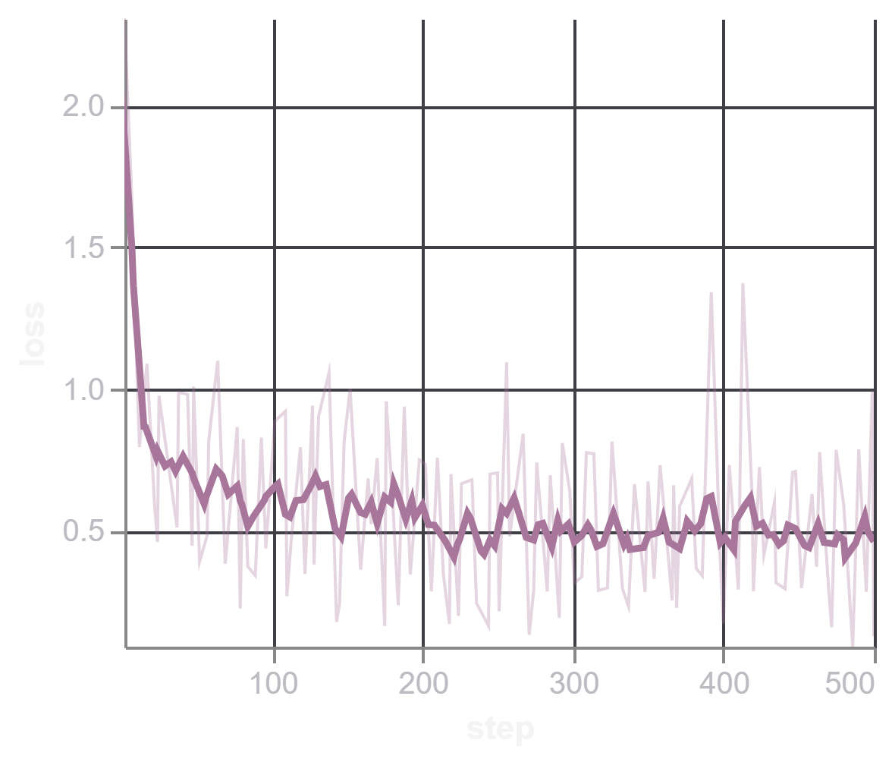
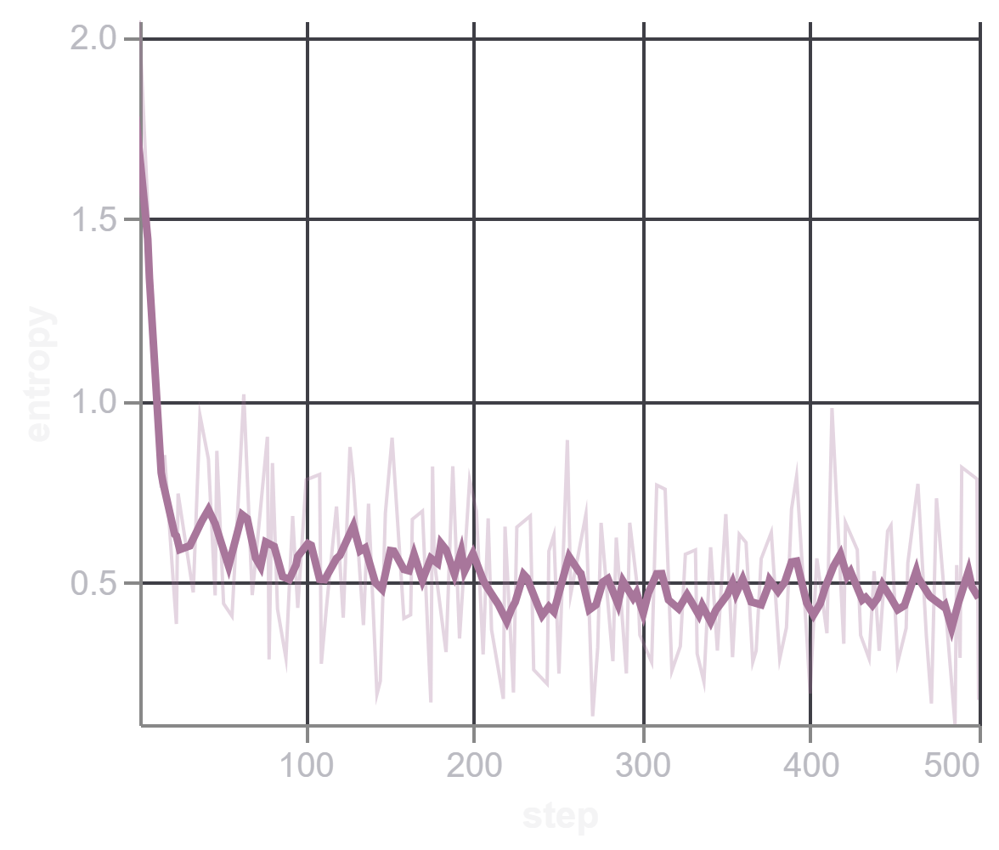
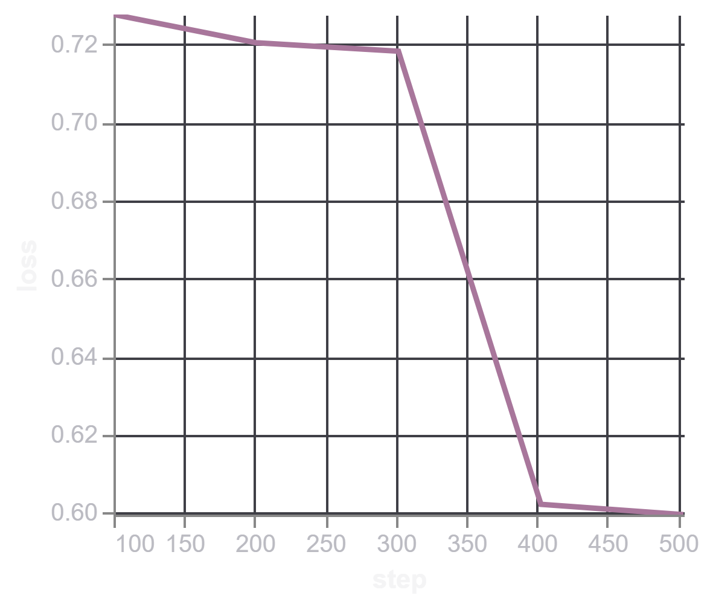
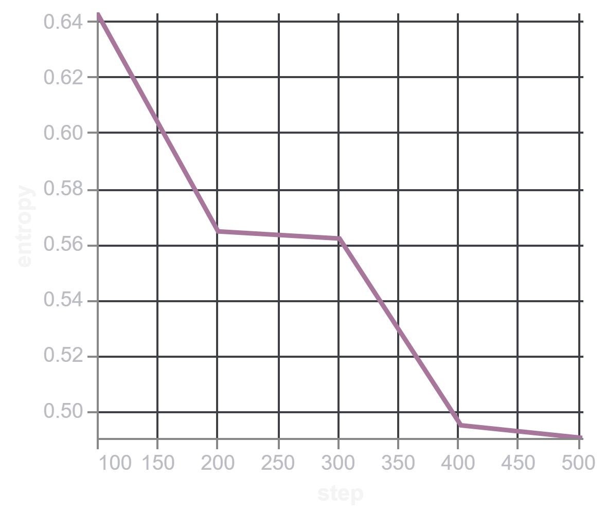

- This is a write-up of fine-tuning Qwen2.5-0.5B (base) for tool calling on the xLAM dataset from Salesforce. Along the way I ran into a few subtle bugs — a frozen `lm_head` that couldn't learn rare special tokens, tied embeddings breaking silently, and some evaluation bugs that were quietly hiding correct predictions — all documented below. After fixing these, the fine-tuned base model ends up performing on par with, and slightly better than, the zero-shot Instruct model on this task.

# Motivation

In case of compute bound, instead of using a large model, can we just fine-tune a small model for domain-specific examples and still get good results? The goal is to fine-tune an SLM for tool calling and check the results. Although current SLMs are already better at tool calling, I still wanted to learn more about SFT and tool calling hands-on.

## Why tool calling?

One obvious question might be, why not something else? The reason is that considering the current era of agentic AI, where an LLM needs to call tools to perform some action, the tool accuracy — and alongside that, the arguments passed — becomes more important. It might be possible that due to hallucination, an argument changes from Capital to small caps, where the tool required the text to be capital.

## Why fine-tune a small model?

Since I already mentioned the compute resources, and also, if I can replicate this tool calling with small models, then for larger models it should not be that much more difficult.

# Model & Dataset

- The latest SLMs from Qwen are already performing very well on tool calling, so I chose the earlier base model for my experiment, which is Qwen2.5-0.5B.
- I have used the xLAM dataset from Salesforce, where a sample looks like:

```python
{
  "query": "Find the sum of all the multiples of 3 and 5 between 1 and 1000. Also find the product of the first five prime numbers.",
  "tools": [
    {
      "name": "math_toolkit.sum_of_multiples",
      "description": "Find the sum of all multiples of specified numbers within a specified range.",
      "parameters": {
        "lower_limit": {
          "type": "int",
          "description": "The start of the range (inclusive).",
          "required": True
        },
        "upper_limit": {
          "type": "int",
          "description": "The end of the range (inclusive).",
          "required": True
        },
        "multiples": {
          "type": "list",
          "description": "The numbers to find multiples of.",
          "required": True
        }
      }
    },
    {
      "name": "math_toolkit.product_of_primes",
      "description": "Find the product of the first n prime numbers.",
      "parameters": {
        "count": {
          "type": "int",
          "description": "The number of prime numbers to multiply together.",
          "required": True
        }
      }
    }
  ],
  "answers": [
    {
      "name": "math_toolkit.sum_of_multiples",
      "arguments": {
        "lower_limit": 1,
        "upper_limit": 1000,
        "multiples": [3, 5]
      }
    },
    {
      "name": "math_toolkit.product_of_primes",
      "arguments": {
        "count": 5
      }
    }
  ]
}
```

- I have used `True` instead of `true`, since the sample is shown as a Python dict here rather than raw JSON.
- Each JSON object specifies:
  - **query** — the query with the params possibly needed for the tools
  - **tools** — the available tools which can be called, where each tool has a description and specifies its arguments; each argument has a description, the type of arg it takes, and whether it's required
  - **answers** — a list of tools and their corresponding args (key-value pairs) which need to be passed to the tool


# Preparing the Dataset

- Instead of using all 60k samples, I took only 2,500 samples, where I used 2000 as train, 100 as validation, and 400 as test samples.
- Given the query, tools, and answers, I needed to apply a chat template to convert them into the required format.
- For that purpose, I used the chat template of Qwen2.5-0.5B and defined two functions — one for train/validation, and another for test.

```{python}
def generate_train_val_sample(sample):
  messages = [
      {
          "role": "user",
          "content": sample["query"]
      },
      {
          "role": "assistant",
          "tool_calls": [
              {
                  "function": {
                      "name": answer["name"],
                      "arguments": answer["arguments"]
                  }
              }
              for answer in json.loads(sample["answers"])
          ]
      }
  ]

  tools = json.loads(sample["tools"])
  text = tokenizer.apply_chat_template(
        messages,
        tools=tools,
        tokenize=False,
        add_generation_prompt=False,
    )

  return  {"text": text}
```

```{python}
def generate_test_sample(sample):
  messages = [
      {
          "role": "user",
          "content": sample["query"]
      }
  ]

  tools = json.loads(sample["tools"])
  text = tokenizer.apply_chat_template(
        messages,
        tools=tools,
        tokenize=False,
        add_generation_prompt=True,
    )

  return  {"text": text}
```

- As can be seen from the functions above, we pass `answers` in the case of train and validation and set `add_generation_prompt` to `False`, since we are not generating — we are comparing against the already-known text.
- For test, we don't pass `answers`, and we set `add_generation_prompt` to `True`.

- Using these two functions, we can convert any sample into the required format.

**Converted train/validation sample**

```text
<|im_start|>system
You are a helpful assistant.

# Tools

You may call one or more functions to assist with the user query.

You are provided with function signatures within <tools></tools> XML tags:
<tools>
{"name": "get_order", "description": "Fetches the order information for a given order ID using the Toolbench RapidAPI.", "parameters": {"is_id": {"description": "The ID of the order to be fetched.", "type": "str", "default": ""}}}
</tools>

For each function call, return a json object with function name and arguments within <tool_call></tool_call> XML tags:
<tool_call>
{"name": <function-name>, "arguments": <args-json-object>}
</tool_call><|im_end|>
<|im_start|>user
Retrieve the order status for \'ORD11223\' and \'ORD44556\'.<|im_end|>
<|im_start|>assistant
<tool_call>
{"name": "get_order", "arguments": {"is_id": "ORD11223"}}
</tool_call>
<tool_call>
{"name": "get_order", "arguments": {"is_id": "ORD44556"}}
</tool_call><|im_end|>'
```


**Converted test sample**
```text
<|im_start|>system
You are a helpful assistant.

# Tools

You may call one or more functions to assist with the user query.

You are provided with function signatures within <tools></tools> XML tags:
<tools>
{"name": "get_order", "description": "Fetches the order information for a given order ID using the Toolbench RapidAPI.", "parameters": {"is_id": {"description": "The ID of the order to be fetched.", "type": "str", "default": ""}}}
</tools>

For each function call, return a json object with function name and arguments within <tool_call></tool_call> XML tags:
<tool_call>
{"name": <function-name>, "arguments": <args-json-object>}
</tool_call><|im_end|>
<|im_start|>user
Retrieve the order status for \'ORD11223\' and \'ORD44556\'.<|im_end|>
<|im_start|>assistant
```

- I've used the same example above to show how it looks in both train/validation and test form.
- As we can see, the text contains all the required pieces — system prompt, user query, and available tools — and depending on the type of sample, it either includes the assistant's response and ends with the `<|im_end|>` token, or it ends right at `<|im_start|>assistant`, triggering the model to generate the response.

# SFT Setup

- I used PEFT and TRL for doing supervised fine-tuning, and didn't use Unsloth because Unsloth requires some of the latest GPUs, and my current laptop doesn't have that.
- I had the option of using Colab, but at the same time, I wanted to check the internal working of the functions I was importing, so instead I switched to my local setup.

## Phase 1

- In case of the PEFT configuration:
  - I used rank 16 and `lora_alpha` 32 [following the HuggingFace SFT article]
  - Target modules were `q_proj`, `k_proj`, `v_proj`, `o_proj`, `gate_proj`, `up_proj`, `down_proj`

- I fine-tuned and checked the results.
- Some weird tokens were coming in place of `<tool_call>` and `</tool_call>`.
- Eventually I found out that, since I was fine-tuning a base model, the embedding/`lm_head` doesn't know much about the `tool_call` token. Also, `embed_tokens` and `lm_head` are tied in the base model, so I needed to account for that too — otherwise the two matrices would end up with different values instead of staying tied.

## Phase 2

- I trained `embed_tokens` instead of keeping it frozen, while making sure there wouldn't end up being two separate matrices instead of one, by passing `ensure_weight_tying=True`.
  - `modules_to_save=["lm_head", "embed_tokens"]`
  - `ensure_weight_tying=True`

- Below is the PEFT config I used finally:

```text
peft_config = LoraConfig(
    r=16,
    lora_alpha=32,
    task_type=TaskType.CAUSAL_LM,
    target_modules=["q_proj", "k_proj", "v_proj", "o_proj", "gate_proj", "up_proj", "down_proj"],
    modules_to_save=["lm_head", "embed_tokens"],
    ensure_weight_tying=True,
)
```

- Below is the `SFTConfig` I used:

```text
training_args = SFTConfig(
    # Training schedule / optimization
    per_device_train_batch_size = BATCH_SIZE,      # Batch size per GPU
    gradient_accumulation_steps = 4,      # Effective batch size = 1 * 4 = 4
    warmup_steps = WARMUP_STEPS,
    max_steps=MAX_STEPS,
    learning_rate = 2e-4,                 # Learning rate for the optimizer
    optim = "paged_adamw_8bit",           # Optimizer

    # Logging / reporting
    eval_strategy="steps",
    eval_steps=EVAL_STEPS,
    save_strategy="steps",
    save_steps=SAVE_STEPS,
    save_total_limit=2,
    load_best_model_at_end=True,
    metric_for_best_model="eval_loss",
    greater_is_better=False,
    logging_steps=1,                      # Log training metrics every N steps
    report_to="trackio",                  # Experiment tracking tool
    run_name="testing",
    output_dir=OUTPUT_DIR,                # Where to save model checkpoints and logs

    max_length=1024,                      # Maximum input sequence length
    activation_offloading=True,           # Offload activations to CPU to reduce GPU memory usage
)
```

- Specifically, batch size is 1 with gradient accumulation of 4, and learning rate is 2e-4.
- Sequence length was 1024, since I didn't need to generate a whole paragraph, and max train steps were only 500 — I think if I train it for longer, the results would likely get better.
- Training setup: I used CUDA-enabled PyTorch with some restrictions, like not being able to use `torch.compile` due to the older GPU. I used Trackio to track training and validation logs.

## Training Logs
<div style="display: flex; justify-content: center; gap: 20px;">

<figure style="text-align: center; width: 48%;">
  
  <figcaption>Train Loss</figcaption>
</figure>

<figure style="text-align: center; width: 48%;">
  
  <figcaption>Train Entropy</figcaption>
</figure>

</div>

<div style="display: flex; justify-content: center; gap: 20px;">

<figure style="text-align: center; width: 48%;">
  
  <figcaption>Evaluation Loss</figcaption>
</figure>

<figure style="text-align: center; width: 48%;">
  
  <figcaption>Evaluation Entropy</figcaption>
</figure>

</div>


# Evaluation
- first i checked whether the predicted answers have all the available tools as present in ground truth and then checked for the arguments present and the values passed against those arguments
- compared the result of finetuned base model with instruct version of qwen-2.5-0.5B

# Results

**Before fine-tuning (base model)**

```text
User Query: I need an advanced chart for 'BINANCE:ETHUSDT' with MACD and RSI indicators, in light theme, and a 4h interval. Also, provide a list of stocks that are overbought according to RSI on page 3.
Actual Output: [{"name": "advanced_chart", "arguments": {"symbol": "BINANCE:ETHUSDT", "studies": "MACD,RSI", "theme": "light", "interval": "4h"}}, {"name": "rsi_overbought", "arguments": {"page": 3}}]
Predicted Output: To fetch the advanced chart for 'BINANCE:ETHUSDT' with MACD and RSI indicators, in light theme, and a 4h interval, you can use the following code:

{
    "name": "advanced_chart",
    "arguments": {
        "symbol": "BINANCE:ETHUSDT",
        "studies": ["MACD", "RSI"],
        "format": "png",
        "theme": "light",
        "interval": "4h",
        "width": 800,
        "height": 600,
        "timezone": "Etc/UTC"
    }
}

This code will fetch the advanced chart for 'BINANCE:ETHUSDT' with MACD and RSI indicators, in light theme, and a 4h interval. The arguments include the symbol, studies, format, theme, interval, width, height, and timezone.

To fetch a list of stocks that are overbought according to RSI on page 3, you can use the following code:

{
    "name": "rsi_overbought",
    "arguments": {
        "page": 3,
        "studies": ["RSI"],
        "format": "png",
        "theme": "light",
        "interval": "4h",
        "width": 800,
        "height": 600,
        "timezone": "Etc/UTC"
    }
}

This code will fetch a list of stocks that are overbought according to RSI on page 3, with MACD and RSI indicators, in light theme, and a 4h interval. The arguments include the page number, studies, format, theme, interval, width, height, and timezone.
```

The base model, before fine-tuning, doesn't call tools at all — it responds conversationally and hallucinates extra arguments (`format`, `width`, `height`, `timezone`) that were never part of the tool's actual schema.

**After fine-tuning**

```text
User Query: I need an advanced chart for 'BINANCE:ETHUSDT' with MACD and RSI indicators, in light theme, and a 4h interval. Also, provide a list of stocks that are overbought according to RSI on page 3.
Actual Output: [{"name": "advanced_chart", "arguments": {"symbol": "BINANCE:ETHUSDT", "studies": "MACD,RSI", "theme": "light", "interval": "4h"}}, {"name": "rsi_overbought", "arguments": {"page": 3}}]
Predicted Output: <tool_call>
{"name": "advanced_chart", "arguments": {"symbol": "BINANCE:ETHUSDT", "studies": "MACD,RSI", "theme": "light", "interval": "4h"}}
</tool_call>
<tool_call>
{"name": "rsi_overbought", "arguments": {"page": 3}}
</tool_call>
```

After fine-tuning, the model correctly emits both tool calls in the expected `<tool_call>` format, with arguments matching the ground truth exactly.

## Evaluated on 400 held-out test samples

| Metric            | Base (LoRA) | Instruct (zero-shot) |
|-------------------|:-----------:|:---------------------:|
| Valid JSON        | 98.75%      | 96.75%                |
| Exact Match       | 58.75%      | 59.25%                |
| Tool Accuracy     | 93.89%      | 92.45%                |
| Argument Accuracy | 81.58%      | 80.64%                |

# What I Learned

- For SLMs, the embedding and `lm_head` are generally kept tied, to reduce the parameter count.
- In this case, the tokenizer's vocab size was lesser than the number of tokens the embedding module could actually represent — this extra headroom becomes useful if new tokens need to be added during fine-tuning.
- When adding extra tokens, the embedding and `lm_head` also need to be trained — otherwise the model produces weird/garbage tokens as output.

# Code

Full training and evaluation code: [https://github.com/riteshrm/qwen2.5-tool-calling-lora](#)